**TRƯỜNG ĐẠI HỌC CÔNG NGHỆ ĐỒNG NAI**

**PHÒNG KHOA HỌC CÔNG NGHỆ**

TÀI LIỆU

**PHÂN TÍCH VÀ THIẾT KẾ HỆ THỐNG**

**HỆ THỐNG QUẢN LÝ NGHIÊN CỨU KHOA HỌC**

Mã tài liệu: SAD-NCKH-001

Phiên bản: 0.2 — Bản dự thảo

Ngày lập: Tháng 07/2026

*Tài liệu này thuộc phạm vi nội bộ — Không phát hành ra bên ngoài khi chưa có sự đồng ý của chủ đầu tư.*

# LỊCH SỬ THAY ĐỔI TÀI LIỆU

| **Phiên bản** | **Ngày** | **Nội dung thay đổi** | **Ghi chú** |
| --- | --- | --- | --- |
| 1.0 | 07/2026 | Khởi tạo tài liệu Phân tích và Thiết kế Hệ thống dựa trên bộ FRS đã hoàn thiện |  |

# MỤC LỤC

LỊCH SỬ THAY ĐỔI TÀI LIỆU 2

MỤC LỤC 3

CHƯƠNG 1. TỔNG QUAN HỆ THỐNG 9

1.1. Giới thiệu chung 9

1.2. Mục tiêu hệ thống 9

1.3. Phạm vi hệ thống 9

1.4. Đối tượng sử dụng 10

1.5. Công nghệ sử dụng 11

CHƯƠNG 2. PHÂN TÍCH YÊU CẦU HỆ THỐNG 12

2.1. Tổng hợp yêu cầu chức năng 12

2.1.1. Nhóm chức năng nền tảng dùng chung 12

2.1.2. Nhóm chức năng nghiệp vụ theo phân hệ 12

2.2. Yêu cầu phi chức năng 12

2.3. Danh sách Actor hệ thống 13

2.4. Sơ đồ Use Case tổng quát 14

CHƯƠNG 3. THIẾT KẾ KIẾN TRÚC HỆ THỐNG 16

3.1. Kiến trúc tổng thể 16

3.2. Kiến trúc 2 tầng: nền tảng dùng chung và nghiệp vụ riêng 16

3.3. Sơ đồ thành phần hệ thống (Component Diagram) 17

3.4. Sơ đồ triển khai (Deployment Diagram) 17

3.5. Lựa chọn công nghệ và lý do 18

CHƯƠNG 4. THIẾT KẾ CƠ SỞ DỮ LIỆU 19

4.1. Mô hình dữ liệu tổng thể (ERD) 19

4.2. Mô tả các nhóm bảng dữ liệu chính 19

4.3. Từ điển dữ liệu (các bảng trọng yếu) 20

4.3.1. Bảng ResearchHourYearly 20

4.3.2. Bảng FunctionPermission 20

CHƯƠNG 5. THIẾT KẾ CHỨC NĂNG DÙNG CHUNG — WORKFLOW ENGINE 23

5.1. Mục tiêu thiết kế 23

5.2. Sơ đồ lớp (Class Diagram) 23

5.3. Sơ đồ trạng thái (State Diagram) 24

5.4. Sơ đồ tuần tự xử lý một bước chuyển trạng thái 24

5.5. Cơ chế versioning và chiến lược Freeze 25

5.6. Cấu trúc XML định nghĩa quy trình 26

CHƯƠNG 6. CHỨC NĂNG DÙNG CHUNG: XÁC THỰC, PHÂN QUYỀN VÀ HỒ SƠ KHOA HỌC CÁ NHÂN 27

6.1. Danh sách chức năng con 27

6.2. Bảng phân quyền theo vai trò 27

6.3. Sơ đồ lớp 28

6.4. Sơ đồ tuần tự xác thực 29

6.5. Định mức giờ NCKH nghĩa vụ theo nhóm nhân sự 29

6.6. Bảng dữ liệu chi tiết 30

6.6.1. Bảng Account 30

6.6.2. Bảng TeacherProfile 30

6.6.3. Bảng ResearchHourYearly 30

6.6.4. Bảng PermissionAssignment / FunctionPermission / ResearchHourPolicy 31

CHƯƠNG 7. CHỨC NĂNG DÙNG CHUNG: QUẢN LÝ HỘI ĐỒNG 32

7.1. Danh sách chức năng con 32

7.2. Bảng phân quyền theo vai trò 32

7.3. Sơ đồ lớp 33

7.4. Bảng dữ liệu chi tiết 33

CHƯƠNG 8. CHỨC NĂNG DÙNG CHUNG: FORM VÀ PDF PIPELINE 35

8.1. Danh sách chức năng con 35

8.2. Bảng phân quyền theo vai trò 35

8.3. Sơ đồ lớp 35

8.4. Bảng dữ liệu chi tiết 36

CHƯƠNG 9. THIẾT KẾ TÍCH HỢP TRÍ TUỆ NHÂN TẠO (AI) 38

9.1. Mục tiêu 38

9.2. Kiến trúc tích hợp AI 38

9.3. Mô tả chi tiết các chức năng AI 38

9.3.1. Tìm kiếm tổng hợp 38

9.3.2. Báo cáo tự động 39

9.3.3. Cảnh báo thông minh 39

CHƯƠNG 10. PHÂN HỆ: THỰC HIỆN ĐỀ TÀI NCKH CẤP TRƯỜNG 41

10.1. Danh sách chức năng con (module) 41

10.2. Bảng phân quyền theo actor 41

10.3. Sơ đồ Use Case 42

10.4. Sơ đồ lớp 43

10.5. Sơ đồ tuần tự 44

10.6. Sơ đồ trạng thái 45

10.7. Bảng dữ liệu chi tiết 45

CHƯƠNG 11. PHÂN HỆ: NGHIỆM THU SẢN PHẨM NGHIÊN CỨU KHOA HỌC 47

11.1. Danh sách chức năng con (module) 47

11.2. Bảng phân quyền theo actor 47

11.3. Sơ đồ Use Case 48

11.4. Sơ đồ lớp 49

11.5. Sơ đồ tuần tự 50

11.6. Sơ đồ trạng thái 50

11.7. Bảng dữ liệu chi tiết 51

CHƯƠNG 12. PHÂN HỆ: QUẢN LÝ ĐỀ TÀI CẤP NHÀ NƯỚC, CẤP TỈNH/BỘ, NGÀNH 53

12.1. Danh sách chức năng con (module) 53

12.2. Bảng phân quyền theo actor 53

12.3. Sơ đồ Use Case 54

12.4. Sơ đồ lớp 55

12.5. Sơ đồ tuần tự 56

12.6. Sơ đồ trạng thái 56

12.7. Bảng dữ liệu chi tiết 57

CHƯƠNG 13. PHÂN HỆ: CHUYỂN GIAO CÔNG NGHỆ VÀ DỊCH VỤ 59

13.1. Danh sách chức năng con (module) 59

13.2. Bảng phân quyền theo actor 59

13.3. Sơ đồ Use Case 60

13.4. Sơ đồ lớp 61

13.5. Sơ đồ tuần tự 62

13.6. Sơ đồ trạng thái 62

13.7. Bảng dữ liệu chi tiết 63

CHƯƠNG 14. PHÂN HỆ: TỔ CHỨC HỘI NGHỊ, HỘI THẢO 65

14.1. Danh sách chức năng con (module) 65

14.2. Bảng phân quyền theo actor 65

14.3. Sơ đồ Use Case 66

14.4. Sơ đồ lớp 67

14.5. Sơ đồ tuần tự 68

14.6. Sơ đồ trạng thái 68

14.7. Bảng dữ liệu chi tiết 69

CHƯƠNG 15. THIẾT KẾ GIAO DIỆN NGƯỜI DÙNG (TỔNG QUAN) 72

15.1. Nguyên tắc thiết kế 72

15.2. Danh sách nhóm màn hình chính 72

CHƯƠNG 16. YÊU CẦU AN TOÀN HỆ THỐNG VÀ BẢO MẬT 74

16.1. Nguyên tắc bảo mật tổng thể 74

16.2. Tính không thể chối từ (Non-repudiation) 74

16.3. Sao lưu và khôi phục dữ liệu 74

CHƯƠNG 17. TÓM TẮT KẾ HOẠCH TRIỂN KHAI 76

17.1. Lộ trình 6 giai đoạn 76

17.2. Định hướng mở rộng sau giai đoạn 1 76

PHỤ LỤC 77

A. Danh mục từ viết tắt 77

B. Tài liệu tham chiếu 77

**PHẦN I — TỔNG QUAN, YÊU CẦU VÀ KIẾN TRÚC HỆ THỐNG**

# CHƯƠNG 1. TỔNG QUAN HỆ THỐNG

## 1.1. Giới thiệu chung

Hệ thống Quản lý Nghiên cứu Khoa học (sau đây gọi tắt là Hệ thống) được xây dựng nhằm số hóa toàn bộ nghiệp vụ quản lý hoạt động nghiên cứu khoa học (NCKH) của Trường Đại học Công nghệ Đồng Nai (DNTU), thay thế quy trình xử lý hồ sơ giấy/thủ công hiện tại bằng một nền tảng phần mềm thống nhất, có khả năng theo dõi trạng thái xử lý theo thời gian thực, lưu vết đầy đủ và hỗ trợ ra quyết định bằng công cụ trí tuệ nhân tạo (AI).

Tài liệu này trình bày kết quả phân tích yêu cầu và thiết kế hệ thống ở mức tổng thể, làm cơ sở cho đội ngũ phát triển triển khai chi tiết, đồng thời làm căn cứ nghiệm thu sản phẩm phần mềm giữa các bên liên quan.

## 1.2. Mục tiêu hệ thống

-   Số hóa và chuẩn hóa 5 quy trình nghiệp vụ NCKH cốt lõi của Trường, đảm bảo tính nhất quán và minh bạch trong toàn bộ vòng đời xử lý hồ sơ.
-   Xây dựng một nền tảng dùng chung (Workflow Engine, Form/PDF pipeline, Hội đồng, Phân quyền, Thông báo) có khả năng tái sử dụng cho cả 5 phân hệ nghiệp vụ và mở rộng cho các quy trình phát sinh trong tương lai mà không cần viết lại từ đầu.
-   Quản lý tập trung hồ sơ khoa học của từng giảng viên: đề tài tham gia, hướng dẫn sinh viên, bài báo đã nghiệm thu, số giờ NCKH theo từng năm học.
-   Đảm bảo an toàn dữ liệu và tính không thể chối từ (non-repudiation) đối với các quyết định phê duyệt, đánh giá, nghiệm thu đã được ban hành.
-   Tích hợp trí tuệ nhân tạo hỗ trợ tìm kiếm tổng hợp, tự động sinh báo cáo và cảnh báo thông minh cho người dùng và cấp quản lý.

## 1.3. Phạm vi hệ thống

Phạm vi triển khai gồm 05 phân hệ nghiệp vụ NCKH và 01 tầng nền tảng dùng chung, được phân tích chi tiết trong bộ tài liệu Đặc tả yêu cầu chức năng (FRS) đã lập trước đó:

| **STT** | **Phân hệ** | **Số module** | **Số UC** |
| --- | --- | --- | --- |
| 1 | Thực hiện đề tài NCKH cấp trường | 14 | 73 |
| 2 | Nghiệm thu sản phẩm nghiên cứu khoa học | 10 | 34 |
| 3 | Quản lý đề tài cấp Nhà nước/Tỉnh/Bộ/ngành | 8 | 28 |
| 4 | Chuyển giao công nghệ và dịch vụ | 9 | 33 |
| 5 | Tổ chức Hội nghị, Hội thảo | 12 | 32 |

Ngoài ra, phạm vi hệ thống được mở rộng thêm 3 nhóm chức năng nền tảng: (i) Quản lý tài khoản và hồ sơ khoa học cá nhân có liên kết với hệ thống email/nhân sự của Trường; (ii) Phân quyền chi tiết theo chức năng, nhóm quyền và nhóm nhân sự; (iii) Tích hợp AI hỗ trợ tìm kiếm, báo cáo và cảnh báo.

*Số liệu module/UC trong bảng trên phản ánh quy mô gốc theo từng tài liệu FRS. Ở Chương 3 trở đi, các module có tính chất dùng chung (Actor/phân quyền, Quản lý Hội đồng, Form/PDF pipeline, Thông báo/truy vết) được tách và hợp nhất vào tầng nền tảng dùng chung (Chương 6–9); Chương 10–14 trình bày lại quy mô module/UC chỉ còn phần nghiệp vụ đặc thù của từng phân hệ.*

## 1.4. Đối tượng sử dụng

| **Nhóm người dùng** | **Mô tả vai trò chính** |
| --- | --- |
| Giảng viên / Tác giả | Chủ nhiệm đề tài, tác giả sản phẩm NCKH, tham gia toàn bộ 5 phân hệ nghiệp vụ; quản lý hồ sơ khoa học cá nhân |
| Trưởng/Phó Khoa, Phòng | Phê duyệt cấp đơn vị, theo dõi tình hình NCKH của Khoa/Phòng phụ trách |
| Ban Giám hiệu / Lãnh đạo | Phê duyệt cấp trường, xem báo cáo tổng hợp toàn trường |
| Phòng Khoa học Công nghệ (P.KHCN) | Đầu mối tiếp nhận, thẩm định, điều phối hồ sơ giữa các bên |
| Hội đồng Khoa học / Nghiệm thu / Xét duyệt | Đánh giá, phản biện, biểu quyết kết quả nghiệm thu |
| Phòng Tài chính - Kế toán (TCKT) | Xử lý thanh toán, quyết toán liên quan hoạt động NCKH |
| Quản trị hệ thống (Admin) | Quản lý phân quyền, publish version workflow/biểu mẫu, vận hành kỹ thuật |
| Cơ quan ngoài (Bộ/Tỉnh, đối tác chuyển giao) | Tham gia gián tiếp qua trao đổi hồ sơ, không có tài khoản đăng nhập trực tiếp |

## 1.5. Công nghệ sử dụng

Hệ thống được lựa chọn xây dựng trên bộ công nghệ hiện đại, phù hợp với năng lực đội ngũ triển khai và khả năng vận hành trên hạ tầng máy chủ hiện có của đơn vị:

| **Thành phần** | **Công nghệ** | **Ghi chú** |
| --- | --- | --- |
| Frontend | Next.js (React) | Server-side rendering, tối ưu SEO và tốc độ tải trang |
| Backend | .NET (ASP.NET Core Web API) | Kiến trúc dịch vụ theo mô hình RESTful API |
| Cơ sở dữ liệu | MS SQL Server hoặc PostgreSQL | Lựa chọn cuối cùng theo hạ tầng và chi phí license thực tế |
| Xác thực | OAuth2 (Google Workspace DNTU) + mã nhân viên | Liên kết module nhân sự hiện có của Trường |
| Hạ tầng triển khai | Docker / Portainer | Theo mô hình đang vận hành trên máy chủ hiện tại |
| Tích hợp AI | LLM Provider (Claude / GPT API) | Phục vụ tìm kiếm tổng hợp, báo cáo, cảnh báo thông minh |

# CHƯƠNG 2. PHÂN TÍCH YÊU CẦU HỆ THỐNG

## 2.1. Tổng hợp yêu cầu chức năng

Yêu cầu chức năng của hệ thống được tổ chức thành 2 nhóm: nhóm chức năng nền tảng dùng chung (triển khai một lần, phục vụ cả 5 phân hệ) và nhóm chức năng nghiệp vụ riêng theo từng phân hệ (chi tiết đầy đủ theo mức UC đã có trong 5 tài liệu FRS).

### 2.1.1. Nhóm chức năng nền tảng dùng chung

| **Nhóm chức năng** | **Mô tả tóm tắt** |
| --- | --- |
| Xác thực & Phân quyền (Auth/RBAC) | Đăng nhập liên kết DNTU, quản lý vai trò và nhóm nhân sự |
| Workflow Engine | Thực thi luồng xử lý đa bước, cấu hình qua XML, có version hoá và lưu lịch sử |
| Quản lý Hội đồng | Thành lập hội đồng, phân công thành viên, thu thập phiếu đánh giá/phản biện |
| Form & PDF Pipeline | Định nghĩa, xác thực dữ liệu và sinh PDF cho các biểu mẫu (BM) |
| Thông báo & Audit log | Thông báo trong ứng dụng, ghi vết mọi thao tác quan trọng |
| Hồ sơ khoa học cá nhân | Tổng hợp đề tài, bài báo, hướng dẫn sinh viên, giờ NCKH theo giảng viên |
| Trợ lý AI | Tìm kiếm tổng hợp, báo cáo tự động, cảnh báo thông minh |

### 2.1.2. Nhóm chức năng nghiệp vụ theo phân hệ

Chi tiết đầy đủ ở mức yêu cầu chức năng (UC), quy tắc nghiệp vụ (BR) và tiêu chí nghiệm thu (AC) của cả 5 phân hệ đã được đặc tả trong bộ tài liệu FRS-NCKH-001 đến FRS-NCKH-005 (đính kèm riêng). Tài liệu này chỉ tổng hợp lại số liệu quy mô làm cơ sở thiết kế kiến trúc và cơ sở dữ liệu ở các chương tiếp theo.

## 2.2. Yêu cầu phi chức năng

| **Mã** | **Nhóm** | **Yêu cầu** |
| --- | --- | --- |
| NFR-SEC-01 | Bảo mật & phân quyền | Người dùng chỉ thao tác được chức năng và dữ liệu thuộc phạm vi được cấp quyền theo vai trò và nhóm nhân sự |
| NFR-AUTH-01 | Xác thực | Đăng nhập bắt buộc qua tài khoản email DNTU (Google OAuth2) hoặc mã nhân viên, không dùng tài khoản/mật khẩu tự do |
| NFR-AUD-01 | Lưu vết | Audit log chỉ thêm mới (append-only), không cho sửa/xóa qua chức năng nghiệp vụ |
| NFR-VER-01 | Tính bất biến của quy trình | Workflow/biểu mẫu đã publish áp dụng theo cơ chế Freeze — instance đang chạy không bị ảnh hưởng khi có version mới |
| NFR-REL-01 | Sao lưu/khôi phục | Dữ liệu được sao lưu định kỳ, có khả năng khôi phục khi sự cố (RPO/RTO cần xác minh) |
| NFR-UX-01 | Khả dụng giao diện | Giao diện responsive, dùng tốt trên máy tính và thiết bị di động |
| NFR-AI-01 | Độ tin cậy AI | Kết quả do AI tổng hợp/báo cáo phải trích dẫn được nguồn dữ liệu gốc, không suy diễn số liệu không có căn cứ |
| NFR-PERF-01 | Hiệu năng | Thời gian phản hồi API trung bình dưới 2 giây với thao tác thông thường (chỉ số cụ thể cần xác minh theo tải thực tế) |

## 2.3. Danh sách Actor hệ thống

Danh sách actor kế thừa từ 5 tài liệu FRS, bổ sung thêm các actor phục vụ nhóm chức năng nền tảng mới (quản trị phân quyền, hệ thống SSO ngoài, dịch vụ AI):

| **Actor** | **Loại** |
| --- | --- |
| Giảng viên / Tác giả / Chủ nhiệm đề tài | Người dùng nội bộ |
| Đơn vị quản lý trực thuộc (ĐVQLTT), Đơn vị tổ chức (ĐVTC) | Người dùng nội bộ |
| Phòng Khoa học Công nghệ (P.KHCN) | Người dùng nội bộ |
| Trưởng/Phó Khoa, Phòng | Người dùng nội bộ (nhóm nhân sự quản lý) |
| Ban Giám hiệu (BGH) / Lãnh đạo | Người dùng nội bộ (nhóm nhân sự lãnh đạo) |
| Hội đồng Khoa học / Nghiệm thu / Xét duyệt (HĐKH/HĐNT/HĐXD) | Người dùng nội bộ (vai trò theo từng đợt) |
| Phòng Tài chính - Kế toán (TCKT) | Người dùng nội bộ |
| Trung tâm thư viện (TTTV) | Người dùng nội bộ |
| Quản trị hệ thống (Admin) | Người dùng nội bộ (kỹ thuật) |
| Hệ thống Email/SSO DNTU (Google Workspace, module nhân sự) | Hệ thống ngoài |
| Cơ quan quản lý cấp trên (Bộ/Tỉnh), Cơ quan nhà nước (CQNN), Bên nhận chuyển giao | Bên ngoài, không có tài khoản |
| Dịch vụ AI (LLM Provider) | Hệ thống ngoài |

## 2.4. Sơ đồ Use Case tổng quát

Sơ đồ dưới đây thể hiện các nhóm chức năng chính và mối liên hệ với từng nhóm actor, tổng hợp từ cả 5 phân hệ nghiệp vụ và các nhóm chức năng nền tảng mới bổ sung.

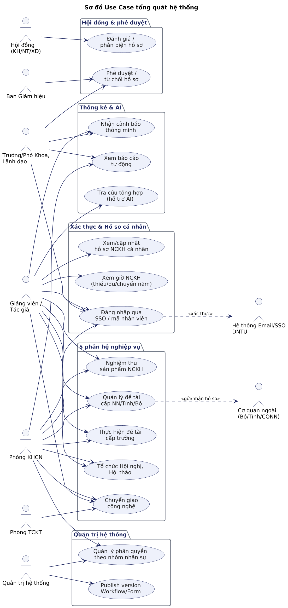

***Hình 2.1 — Sơ đồ Use Case tổng quát hệ thống***

# CHƯƠNG 3. THIẾT KẾ KIẾN TRÚC HỆ THỐNG

## 3.1. Kiến trúc tổng thể

Hệ thống được thiết kế theo kiến trúc phân lớp (layered architecture) gồm 3 tầng chính: tầng người dùng (Web Application xây dựng trên Next.js), tầng dịch vụ backend (các microservice/module .NET giao tiếp qua API Gateway) và tầng dữ liệu (cơ sở dữ liệu quan hệ, kho tệp và kho vector phục vụ AI). Hệ thống kết nối với 2 nhóm hệ thống ngoài: hệ thống email/SSO của Trường (DNTU) để xác thực người dùng, và nhà cung cấp mô hình ngôn ngữ lớn (LLM) để phục vụ các chức năng AI.

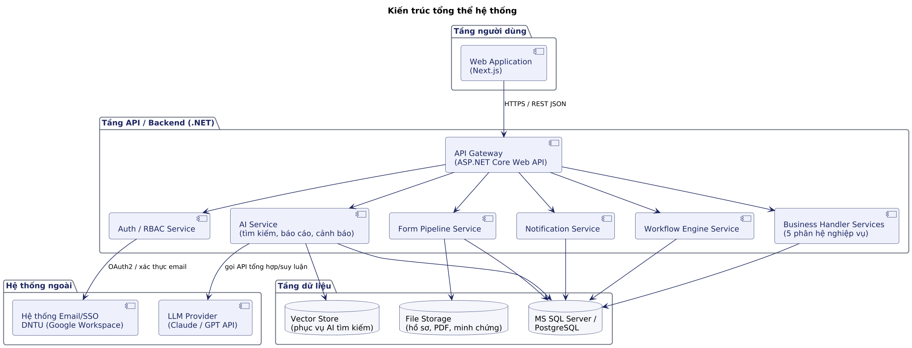

***Hình 3.1 — Kiến trúc tổng thể hệ thống***

## 3.2. Kiến trúc 2 tầng: nền tảng dùng chung và nghiệp vụ riêng

Điểm cốt lõi của thiết kế kiến trúc là tách rõ 2 tầng quan tâm: tầng nền tảng dùng chung được xây dựng một lần và tái sử dụng cho toàn bộ 5 phân hệ nghiệp vụ; tầng nghiệp vụ riêng chỉ chứa phần khác biệt của từng phân hệ (workflow definition dạng XML và các rule/task handler đặc thù). Cách tiếp cận này giúp giảm đáng kể khối lượng công việc khi triển khai phân hệ thứ 3, 4, 5 so với việc xây dựng độc lập từng phân hệ, đồng thời đảm bảo tính nhất quán trong cách xử lý trạng thái, phân quyền và lưu vết trên toàn hệ thống.

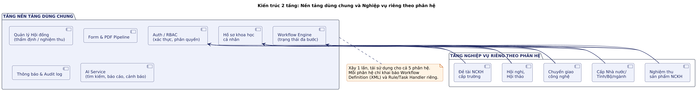

***Hình 3.2 — Kiến trúc 2 tầng: nền tảng dùng chung và nghiệp vụ riêng***

Lưu ý quan trọng: các module "Actor/phân quyền", "Quản lý Hội đồng", "Xử lý biên bản Hội đồng", "Form/PDF pipeline" và "Thông báo/truy vết" từng được liệt kê riêng lẻ trong mỗi tài liệu FRS gốc (do mỗi phân hệ được đặc tả độc lập) nay được hợp nhất và chuyển hẳn vào tầng nền tảng dùng chung. Chương 6–9 trình bày chi tiết các chức năng dùng chung này; Chương 10–14 chỉ còn giữ lại phần chức năng nghiệp vụ thực sự đặc thù của từng phân hệ, tránh trùng lặp thiết kế và tài liệu.

## 3.3. Sơ đồ thành phần hệ thống (Component Diagram)

Sơ đồ thành phần mô tả chi tiết hơn các service cấu thành hệ thống và quan hệ gọi giữa chúng, làm cơ sở cho việc chia module phát triển và xác định ranh giới triển khai (deployment boundary) giữa các nhóm dev phụ trách từng phân hệ.

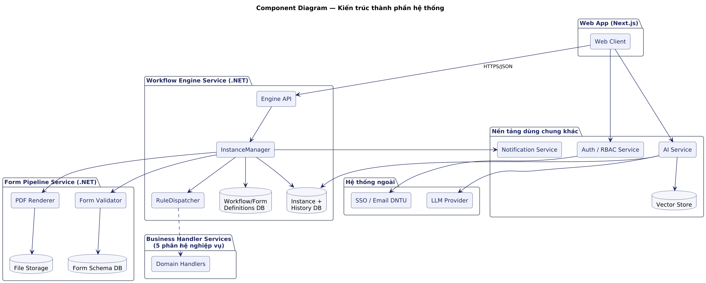

***Hình 3.3 — Sơ đồ thành phần hệ thống***

## 3.4. Sơ đồ triển khai (Deployment Diagram)

Hệ thống được triển khai trên hạ tầng máy chủ hiện có của đơn vị theo mô hình container hóa (Docker), quản lý qua Portainer — phù hợp với cách vận hành các dự án phần mềm khác đang chạy trên cùng hạ tầng. Mỗi nhóm dịch vụ được đóng gói thành một Portainer stack riêng, cho phép triển khai và rollback độc lập.

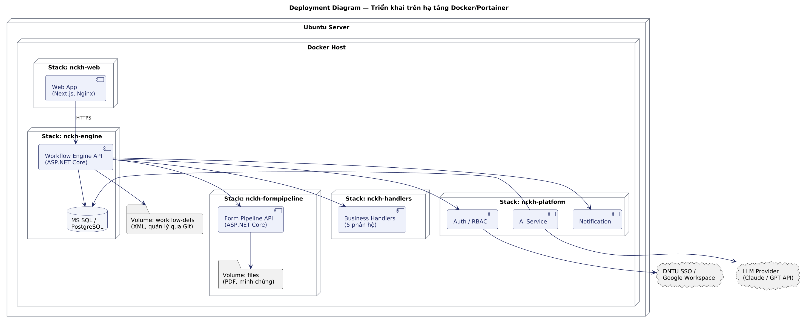

***Hình 3.4 — Sơ đồ triển khai hệ thống trên hạ tầng Docker/Portainer***

Ở giai đoạn triển khai ban đầu (MVP 3 tháng), có thể gộp các stack nckh-engine, nckh-formpipeline và nckh-handlers thành một service .NET duy nhất (nhiều module nội bộ theo namespace) nhằm giảm số lượng container cần vận hành, tách thành các service độc lập chỉ khi hệ thống cần mở rộng quy mô (scale) riêng cho từng phần.

## 3.5. Lựa chọn công nghệ và lý do

| **Thành phần** | **Lựa chọn** | **Lý do** |
| --- | --- | --- |
| Frontend | Next.js | Hỗ trợ Server-side rendering giúp tải trang nhanh, tối ưu cho các trang danh sách/báo cáo nhiều dữ liệu; hệ sinh thái React quen thuộc với đội ngũ phát triển |
| Backend | .NET (ASP.NET Core Web API) | Hiệu năng cao, hỗ trợ tốt kiến trúc RESTful API và tích hợp dễ dàng với MS SQL Server; phù hợp năng lực đội ngũ dev hiện có |
| Cơ sở dữ liệu | MS SQL Server / PostgreSQL | Cả hai đều đáp ứng tốt yêu cầu giao dịch (transaction) của Workflow Engine; lựa chọn cuối cùng phụ thuộc chi phí license và hạ tầng thực tế tại thời điểm triển khai |
| Xác thực | OAuth2 qua Google Workspace DNTU | Tận dụng hạ tầng email nội bộ đã có, không phát sinh chi phí quản lý tài khoản/mật khẩu riêng, giảm rủi ro bảo mật |
| Containerization | Docker / Portainer | Đồng bộ với mô hình vận hành hiện tại của đơn vị trên máy chủ Ubuntu |

# CHƯƠNG 4. THIẾT KẾ CƠ SỞ DỮ LIỆU

## 4.1. Mô hình dữ liệu tổng thể (ERD)

Mô hình dữ liệu được thiết kế theo nguyên tắc tách 2 nhóm bảng: nhóm bảng định nghĩa (definition) mang tính bất biến sau khi publish (WorkflowDefinition, FormDefinition) và nhóm bảng dữ liệu vận hành (runtime) luôn ghi thêm, không ghi đè (WorkflowInstance, FormSubmission, HistoryLog). Ngoài ra, mô hình bổ sung nhóm bảng hồ sơ khoa học cá nhân (TeacherProfile, ResearchHourYearly, PublishedPaper, StudentGuidance) và nhóm bảng phân quyền (Role, StaffGroup, PermissionAssignment, FunctionPermission).

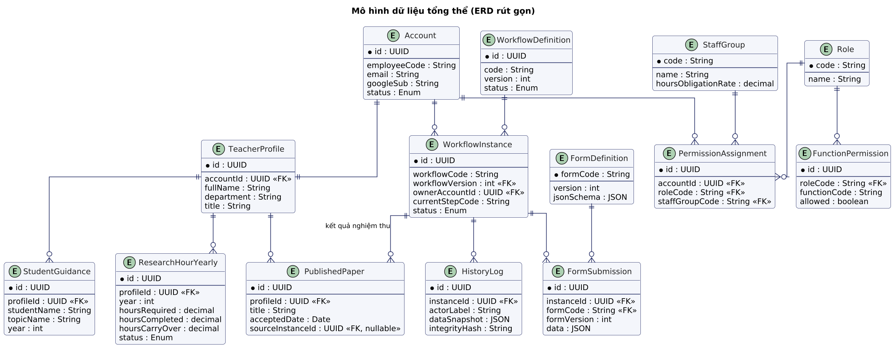

***Hình 4.1 — Mô hình dữ liệu tổng thể (ERD rút gọn)***

## 4.2. Mô tả các nhóm bảng dữ liệu chính

| **Nhóm bảng** | **Vai trò** |
| --- | --- |
| Account, TeacherProfile | Thông tin tài khoản liên kết DNTU và hồ sơ khoa học cá nhân của giảng viên |
| ResearchHourYearly | Số giờ NCKH theo từng năm học: định mức, đã hoàn thành, thiếu/dư, chuyển sang năm sau |
| PublishedPaper, StudentGuidance | Danh sách bài báo đã nghiệm thu và sinh viên đã hướng dẫn, liên kết tới hồ sơ NCKH tương ứng |
| Role, StaffGroup, PermissionAssignment, FunctionPermission | Mô hình phân quyền theo vai trò nghiệp vụ và nhóm nhân sự (chi tiết tại Chương 7) |
| WorkflowDefinition, Step, Transition | Định nghĩa cấu trúc quy trình (bất biến sau publish, version hóa) |
| FormDefinition | Định nghĩa schema dữ liệu của từng biểu mẫu (BM), version hóa độc lập với workflow |
| WorkflowInstance, FormSubmission, HistoryLog | Dữ liệu vận hành thực tế: trạng thái đang xử lý, dữ liệu đã nộp, lịch sử xử lý (chi tiết tại Chương 5) |

## 4.3. Từ điển dữ liệu (các bảng trọng yếu)

### 4.3.1. Bảng ResearchHourYearly

| **Trường** | **Kiểu dữ liệu** | **Mô tả** |
| --- | --- | --- |
| id | UUID | Khóa chính |
| profileId | UUID (FK) | Liên kết tới TeacherProfile |
| year | int | Năm học áp dụng |
| hoursRequired | decimal | Định mức giờ NCKH nghĩa vụ theo nhóm nhân sự của giảng viên trong năm đó |
| hoursCompleted | decimal | Số giờ đã quy đổi/hoàn thành trong năm |
| hoursCarryOver | decimal | Số giờ dư được chuyển từ năm trước hoặc chuyển sang năm sau (giá trị âm/dương) |
| status | Enum | Đủ định mức / Thiếu giờ / Dư giờ |

### 4.3.2. Bảng FunctionPermission

| **Trường** | **Kiểu dữ liệu** | **Mô tả** |
| --- | --- | --- |
| id | UUID | Khóa chính |
| roleCode | String (FK) | Vai trò nghiệp vụ được cấp quyền |
| functionCode | String | Mã chức năng/UC được cấp (vd: UC-DK-01) |
| action | Enum | Xem / Tạo / Sửa / Duyệt / Xóa |
| allowed | boolean | Cho phép hay không |

**PHẦN II — CHỨC NĂNG NỀN TẢNG DÙNG CHUNG**

# CHƯƠNG 5. THIẾT KẾ CHỨC NĂNG DÙNG CHUNG — WORKFLOW ENGINE

## 5.1. Mục tiêu thiết kế

Workflow Engine là thành phần trung tâm của tầng nền tảng dùng chung, có nhiệm vụ thực thi cả 5 quy trình nghiệp vụ (Đề tài cấp trường, Nghiệm thu sản phẩm, Cấp Nhà nước/Tỉnh/Bộ, Chuyển giao công nghệ, Hội nghị Hội thảo) thông qua cơ chế cấu hình (workflow definition), không phải bằng cách viết code riêng cho từng quy trình. Engine không chứa bất kỳ logic nghiệp vụ đặc thù nào của 5 phân hệ — toàn bộ logic đó được đóng gói trong các Rule/Task Handler độc lập, engine chỉ gọi vào thông qua interface chung.

-   Một service duy nhất xử lý cả 5 quy trình, giảm chi phí bảo trì và đảm bảo tính nhất quán trong cách quản lý trạng thái.
-   Mỗi quy trình được mô tả bằng một file định nghĩa dạng XML độc lập, dễ đọc, dễ kiểm tra thủ công.
-   Đảm bảo tính không thể chối từ (non-repudiation): mọi thay đổi trạng thái được ghi vết đầy đủ, không phụ thuộc vào dữ liệu "sống" có thể thay đổi sau này (actor, definition, form).
-   Áp dụng chiến lược Freeze: version workflow/biểu mẫu đã áp dụng cho một hồ sơ được giữ nguyên trong suốt vòng đời hồ sơ đó, kể cả khi có version mới được publish.

## 5.2. Sơ đồ lớp (Class Diagram)

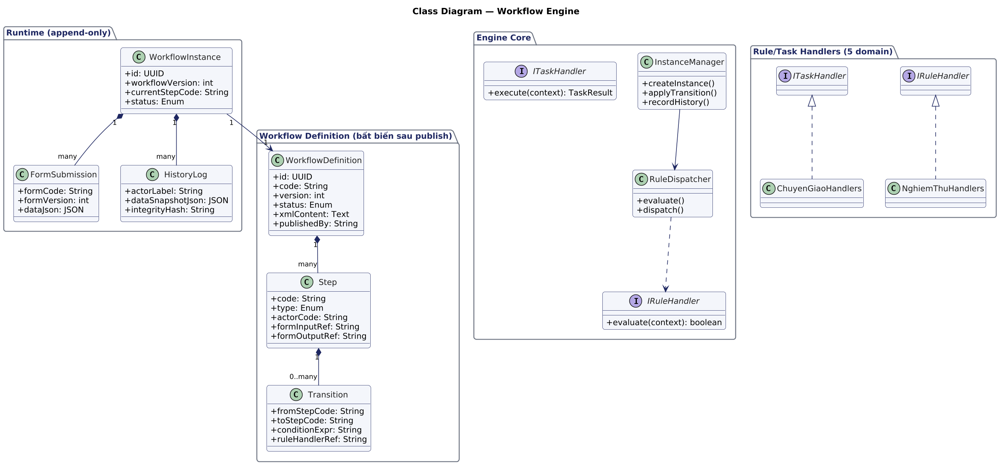

***Hình 5.1 — Class Diagram Workflow Engine***

## 5.3. Sơ đồ trạng thái (State Diagram)

Mỗi WorkflowInstance (một hồ sơ đang được xử lý theo một quy trình cụ thể) tuân theo vòng đời trạng thái thống nhất, áp dụng chung cho cả 5 phân hệ:

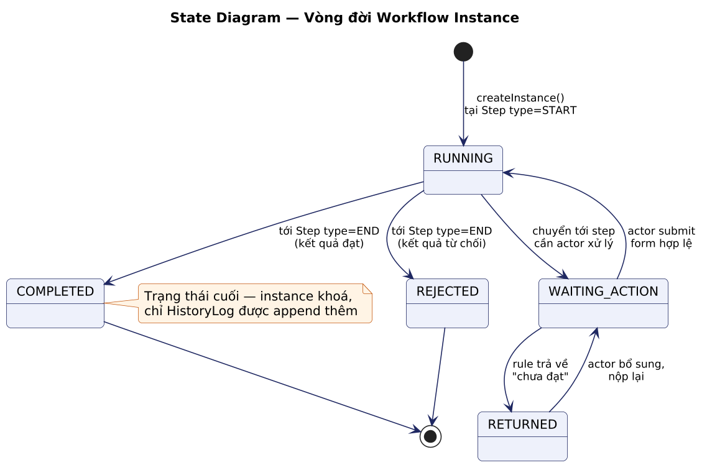

***Hình 5.2 — Sơ đồ trạng thái vòng đời Workflow Instance***

## 5.4. Sơ đồ tuần tự xử lý một bước chuyển trạng thái

Sơ đồ dưới đây minh họa luồng xử lý khi một actor thực hiện hành động tại một bước (step) của quy trình: engine luôn tải definition theo đúng version đã bind trên instance (không phải bản mới nhất), gọi Rule Dispatcher đánh giá điều kiện, và ghi lại lịch sử xử lý trước khi cập nhật trạng thái.

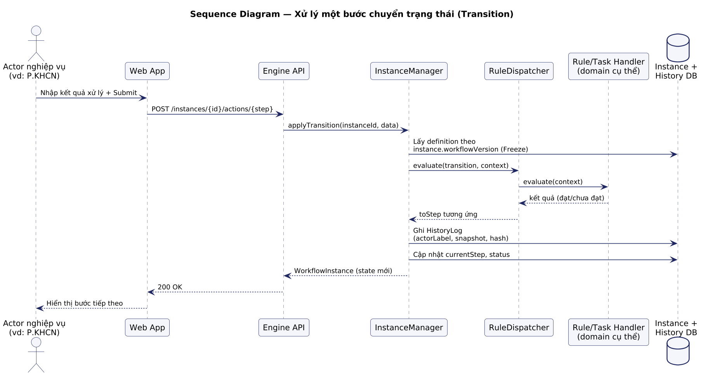

***Hình 5.3 — Sequence Diagram xử lý một bước chuyển trạng thái***

## 5.5. Cơ chế versioning và chiến lược Freeze

Để đảm bảo an toàn khi thay đổi quy trình/biểu mẫu về sau mà không ảnh hưởng tới hồ sơ đã và đang xử lý, hệ thống áp dụng các nguyên tắc sau:

-   Không bao giờ UPDATE trực tiếp lên một workflow definition hoặc form definition đã ở trạng thái published — mọi thay đổi đều tạo ra một bản ghi version mới.
-   Mỗi WorkflowInstance khi được tạo ra sẽ bind cứng vào version đang published tại đúng thời điểm đó (cột workflowVersion); mọi xử lý về sau trên instance đó luôn tham chiếu đúng version đã bind, không tự động chuyển sang version mới hơn.
-   Bảng HistoryLog tự chứa đầy đủ thông tin (self-contained): tên/vai trò actor được lưu dưới dạng văn bản snapshot tại thời điểm xử lý, không tham chiếu khóa ngoại tới bảng Actor/Account có thể thay đổi sau này; kèm theo mã băm toàn vẹn (integrity hash) để phát hiện nếu dữ liệu bị chỉnh sửa hồi tố.
-   Việc publish version mới của workflow/biểu mẫu là thao tác kỹ thuật thủ công, chỉ do đội ngũ phát triển/quản trị hệ thống thực hiện thông qua quy trình quản lý mã nguồn (Git) và script deploy, không cung cấp giao diện chỉnh sửa trực tiếp qua nghiệp vụ; mọi thay đổi cần có căn cứ bằng văn bản (email, ticket, biên bản) được lưu kèm trong lịch sử commit.

## 5.6. Cấu trúc XML định nghĩa quy trình

Mỗi quy trình được mô tả bằng một file XML gồm 3 phần: danh sách actor tham gia, danh sách step (mỗi step gắn với một actor, một biểu mẫu đầu vào và/hoặc đầu ra) và transition (điều kiện chuyển bước, có thể tham chiếu tới rule handler). Ví dụ minh họa cấu trúc áp dụng cho quy trình Nghiệm thu sản phẩm NCKH:

<workflow id="QT.KHCN.01" name="Nghiệm thu sản phẩm NCKH" version="1.0">  
<actors>  
<actor id="TG" name="Tác giả"/>  
<actor id="PKHCN" name="Phòng KHCN"/>  
<actor id="HDKH" name="Hội đồng Khoa học"/>  
</actors>  
<steps>  
<step id="S01\_ChuanBiHoSo" name="Chuẩn bị và nộp hồ sơ" actor="TG" type="start">  
<input><form ref="BM01A\_or\_BM01B"/></input>  
<output><transition to="S02\_KiemTraSoBo"/></output>  
</step>  
<step id="S02\_KiemTraSoBo" name="Kiểm tra sơ bộ" actor="PKHCN">  
<rules><rule id="BR-M02-01" handler="checkTrungLap"/></rules>  
<output>  
<transition to="S03\_HDKHDanhGia" cond="ket\_qua == 'dat'"/>  
<transition to="S01\_ChuanBiHoSo" cond="ket\_qua == 'chua\_dat'"/>  
</output>  
</step>  
</steps>  
</workflow>

Trường type="start" đánh dấu step không có input (điểm bắt đầu instance); step không khai báo transition đầu ra được engine tự động hiểu là điểm kết thúc (end) của quy trình.

# CHƯƠNG 6. CHỨC NĂNG DÙNG CHUNG: XÁC THỰC, PHÂN QUYỀN VÀ HỒ SƠ KHOA HỌC CÁ NHÂN

Đây là nhóm chức năng nền tảng dùng chung, được xây dựng một lần và áp dụng thống nhất cho toàn bộ 5 phân hệ nghiệp vụ. Các chức năng quản lý tài khoản, hồ sơ khoa học cá nhân và phân quyền trước đây xuất hiện rải rác trong yêu cầu của từng phân hệ (ví dụ module "Actor/phân quyền" từng được liệt kê riêng trong mỗi tài liệu FRS) nay được hợp nhất thành một chức năng dùng chung duy nhất, tránh trùng lặp thiết kế và đảm bảo tính nhất quán khi kiểm soát truy cập trên toàn hệ thống.

## 6.1. Danh sách chức năng con

| **Mã** | **Chức năng con** | **Mô tả** |
| --- | --- | --- |
| UC-AUTH-01 | Đăng nhập qua SSO DNTU | Xác thực qua Google OAuth2, đối chiếu mã nhân viên từ module nhân sự |
| UC-AUTH-02 | Khởi tạo/cập nhật tài khoản tự động | Tạo Account + TeacherProfile khi đăng nhập lần đầu; cập nhật đơn vị/chức danh khi có thay đổi |
| UC-PROF-01 | Xem/cập nhật hồ sơ khoa học cá nhân | Đề tài tham gia, hướng dẫn sinh viên, bài báo đã nghiệm thu |
| UC-PROF-02 | Xem giờ NCKH theo năm | Định mức, đã hoàn thành, thiếu/dư, chuyển năm sau |
| UC-PERM-01 | Gán vai trò và nhóm nhân sự cho tài khoản | Admin thiết lập PermissionAssignment |
| UC-PERM-02 | Cấu hình quyền theo chức năng | Admin thiết lập FunctionPermission cho từng Role |
| UC-PERM-03 | Cấu hình định mức giờ NCKH theo nhóm nhân sự | Admin thiết lập ResearchHourPolicy theo StaffGroup và năm học |

## 6.2. Bảng phân quyền theo vai trò

Hệ thống áp dụng mô hình phân quyền kết hợp 3 chiều: Vai trò (Role — xác định hành động nghiệp vụ được phép), Nhóm nhân sự (StaffGroup — quyết định các định mức/chính sách riêng như giờ NCKH nghĩa vụ) và Phạm vi (Scope — giới hạn dữ liệu theo đơn vị công tác). Một tài khoản có thể giữ nhiều vai trò nhưng chỉ thuộc một nhóm nhân sự tại một thời điểm.

| **Chức năng** | **Giảng viên** | **Trưởng/Phó Khoa** | **P.KHCN** | **Admin** |
| --- | --- | --- | --- | --- |
| Đăng nhập, xem hồ sơ của bản thân | X | X | X | X |
| Xem hồ sơ NCKH của đơn vị mình | — | X | X | X |
| Xem hồ sơ NCKH toàn trường | — | — | X | X |
| Gán vai trò / nhóm nhân sự | — | — | — | X |
| Cấu hình quyền theo chức năng | — | — | — | X |
| Cấu hình định mức giờ NCKH | — | — | X (đề xuất) | X (phê duyệt) |

## 6.3. Sơ đồ lớp

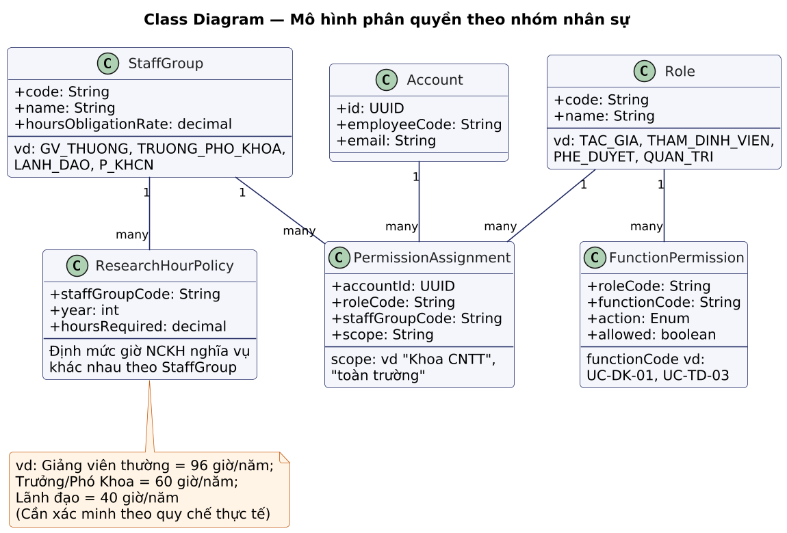

***Hình 6.1 — Class Diagram mô hình phân quyền theo nhóm nhân sự***

## 6.4. Sơ đồ tuần tự xác thực

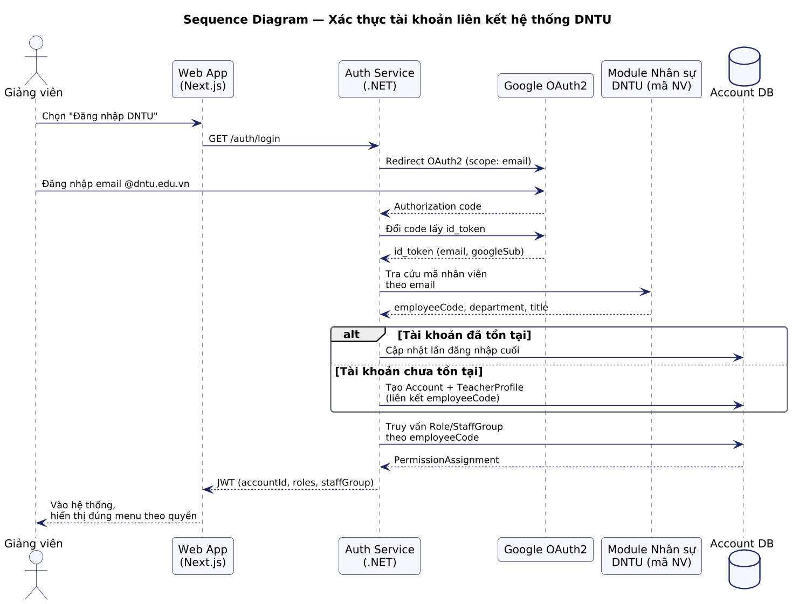

***Hình 6.2 — Sequence Diagram xác thực tài khoản liên kết DNTU***

## 6.5. Định mức giờ NCKH nghĩa vụ theo nhóm nhân sự

Ví dụ minh họa nguyên tắc phân biệt định mức theo StaffGroup — số liệu cụ thể cần xác minh và cấu hình lại theo đúng quy chế chi tiêu nội bộ hiện hành của Trường:

| **Nhóm nhân sự (StaffGroup)** | **Định mức giờ NCKH/năm** | **Ghi chú** |
| --- | --- | --- |
| Giảng viên thường (GV\_THUONG) | 96 giờ | Cần xác minh theo quy chế thực tế của Trường |
| Trưởng/Phó Khoa, Phòng (TRUONG\_PHO\_KHOA) | 60 giờ | Thấp hơn giảng viên thường do kiêm nhiệm quản lý — Cần xác minh |
| Lãnh đạo/Ban Giám hiệu (LANH\_DAO) | 40 giờ | Cần xác minh |
| Cán bộ P.KHCN chuyên trách (CB\_PKHCN) | Không áp dụng / theo quy định riêng | Cần xác minh |

## 6.6. Bảng dữ liệu chi tiết

### 6.6.1. Bảng Account

| **Trường** | **Kiểu dữ liệu** | **Khóa** | **Mô tả** |
| --- | --- | --- | --- |
| id | UUID | PK | Khóa chính |
| employeeCode | String | Unique | Mã nhân viên, đối chiếu module nhân sự DNTU |
| email | String | Unique | Email DNTU dùng đăng nhập |
| googleSub | String | Unique | Định danh tài khoản Google Workspace |
| status | Enum | — | Hoạt động / Ngưng hoạt động |

### 6.6.2. Bảng TeacherProfile

| **Trường** | **Kiểu dữ liệu** | **Khóa** | **Mô tả** |
| --- | --- | --- | --- |
| id | UUID | PK | Khóa chính |
| accountId | UUID | FK → Account | Liên kết tài khoản |
| fullName | String | — | Họ tên giảng viên |
| department | String | — | Đơn vị công tác |
| title | String | — | Chức danh/học hàm học vị |

### 6.6.3. Bảng ResearchHourYearly

| **Trường** | **Kiểu dữ liệu** | **Khóa** | **Mô tả** |
| --- | --- | --- | --- |
| id | UUID | PK | Khóa chính |
| profileId | UUID | FK → TeacherProfile | Giảng viên áp dụng |
| year | int | — | Năm học |
| hoursRequired | decimal | — | Định mức theo StaffGroup |
| hoursCompleted | decimal | — | Số giờ đã hoàn thành |
| hoursCarryOver | decimal | — | Số giờ thiếu/dư chuyển tiếp |
| status | Enum | — | Đủ định mức / Thiếu / Dư |

### 6.6.4. Bảng PermissionAssignment / FunctionPermission / ResearchHourPolicy

| **Bảng** | **Trường khóa chính** | **Trường khóa ngoại** | **Mô tả** |
| --- | --- | --- | --- |
| PermissionAssignment | id (PK) | accountId → Account; roleCode → Role; staffGroupCode → StaffGroup | Gán vai trò + nhóm nhân sự cho 1 tài khoản |
| FunctionPermission | id (PK) | roleCode → Role | Quyền thao tác (functionCode, action, allowed) theo vai trò |
| ResearchHourPolicy | id (PK) | staffGroupCode → StaffGroup | Định mức giờ NCKH theo nhóm nhân sự và năm học |

# CHƯƠNG 7. CHỨC NĂNG DÙNG CHUNG: QUẢN LÝ HỘI ĐỒNG

Chức năng Quản lý Hội đồng phục vụ chung cho tất cả các bước cần thẩm định/đánh giá/nghiệm thu tập thể trong cả 5 phân hệ (Hội đồng Khoa học đánh giá đề tài và nghiệm thu sản phẩm, Hội đồng Nghiệm thu cấp cơ sở của đề tài cấp Nhà nước và chuyển giao công nghệ, Hội đồng Xét duyệt đề xuất chuyển giao, Hội đồng Khoa học phản biện bài viết hội nghị). Thay vì mỗi phân hệ tự cài đặt cơ chế hội đồng riêng, toàn bộ nghiệp vụ này được thiết kế dùng chung, chỉ khác nhau ở thuộc tính loaiHoiDong và instanceId tham chiếu tới hồ sơ nghiệp vụ tương ứng.

## 7.1. Danh sách chức năng con

| **Mã** | **Chức năng con** | **Actor** |
| --- | --- | --- |
| UC-HD-01 | Thành lập hội đồng (quyết định, danh sách thành viên) | P.KHCN / BGH |
| UC-HD-02 | Phân công thành viên đánh giá/phản biện | P.KHCN |
| UC-HD-03 | Lập và nộp phiếu đánh giá/nhận xét | Thành viên Hội đồng |
| UC-HD-04 | Tổng hợp kết luận chung của Hội đồng | Chủ tịch Hội đồng |
| UC-HD-05 | Lập biên bản họp Hội đồng | Thư ký Hội đồng |

## 7.2. Bảng phân quyền theo vai trò

| **Chức năng** | **Thành viên Hội đồng** | **Chủ tịch/Thư ký** | **P.KHCN** | **Admin** |
| --- | --- | --- | --- | --- |
| Thành lập hội đồng | — | — | X | X |
| Nộp phiếu đánh giá/phản biện | X | X | — | — |
| Tổng hợp kết luận | — | X | — | — |
| Lập biên bản họp | — | X | — | — |
| Xem toàn bộ phiếu đánh giá đã nộp | Chỉ phiếu của mình | X | X | X |

## 7.3. Sơ đồ lớp

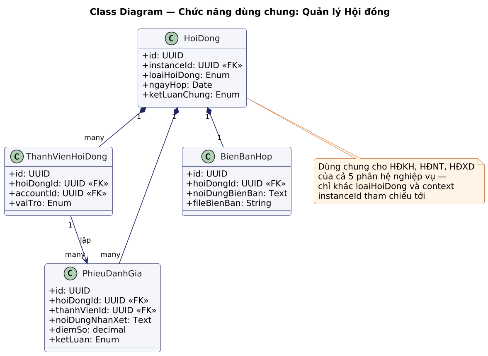

***Hình — Class Diagram chức năng dùng chung: Quản lý Hội đồng***

Sơ đồ tuần tự và sơ đồ trạng thái của chức năng này áp dụng trực tiếp theo mô hình chung của Workflow Engine (Chương 5) — mỗi bước xử lý của Hội đồng (nộp phiếu, tổng hợp kết luận) chính là một transition trong workflow của phân hệ đang áp dụng, không cần thiết kế riêng.

## 7.4. Bảng dữ liệu chi tiết

| **Bảng** | **Trường khóa chính** | **Trường khóa ngoại** | **Mô tả** |
| --- | --- | --- | --- |
| HoiDong | id (PK) | instanceId → WorkflowInstance | 1 hội đồng gắn với 1 hồ sơ nghiệp vụ cụ thể |
| ThanhVienHoiDong | id (PK) | hoiDongId → HoiDong; accountId → Account | Danh sách thành viên và vai trò trong hội đồng |
| PhieuDanhGia | id (PK) | hoiDongId → HoiDong; thanhVienId → ThanhVienHoiDong | Nội dung nhận xét, điểm số, kết luận của từng thành viên |
| BienBanHop | id (PK) | hoiDongId → HoiDong | Biên bản họp chính thức, kết luận chung |

# CHƯƠNG 8. CHỨC NĂNG DÙNG CHUNG: FORM VÀ PDF PIPELINE

Chức năng này quản lý việc định nghĩa, xác thực dữ liệu và sinh PDF cho toàn bộ biểu mẫu (BM) sử dụng xuyên suốt 5 phân hệ (tổng cộng khoảng 50 biểu mẫu theo bộ FRS). Giao diện nhập liệu của từng biểu mẫu được lập trình viên code tay riêng (theo quyết định thiết kế đã thống nhất, nhằm giữ toàn quyền kiểm soát layout), nhưng luôn tham chiếu đúng JSON Schema tương ứng để đảm bảo tính nhất quán dữ liệu và khả năng version hóa độc lập với workflow.

## 8.1. Danh sách chức năng con

| **Mã** | **Chức năng con** | **Actor** |
| --- | --- | --- |
| UC-FORM-01 | Định nghĩa/publish schema biểu mẫu mới | Dev/Admin (qua Git + deploy script) |
| UC-FORM-02 | Xác thực dữ liệu nhập trước khi lưu | Hệ thống (tự động) |
| UC-FORM-03 | Sinh file PDF từ dữ liệu đã nộp | Hệ thống (tự động) |
| UC-FORM-04 | Xem/tải biểu mẫu đã nộp (PDF) | Actor liên quan theo phân quyền |

## 8.2. Bảng phân quyền theo vai trò

| **Chức năng** | **Người nộp form** | **P.KHCN** | **Admin** |
| --- | --- | --- | --- |
| Nộp dữ liệu biểu mẫu | X | — | — |
| Xem/tải PDF biểu mẫu của mình | X | X | X |
| Publish schema biểu mẫu mới | — | — | X |

## 8.3. Sơ đồ lớp

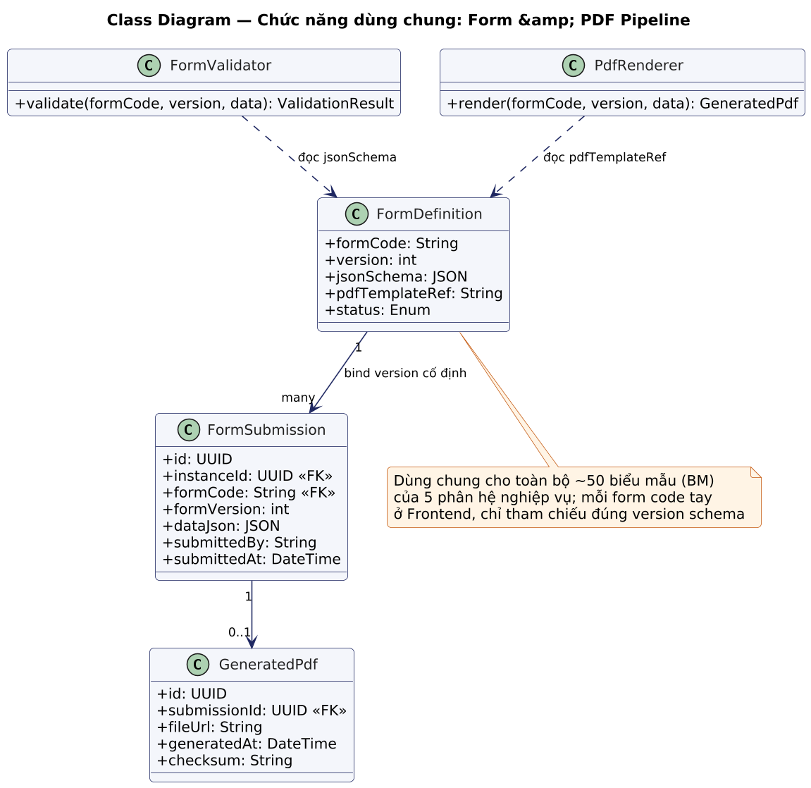

***Hình — Class Diagram chức năng dùng chung: Form & PDF Pipeline***

Tương tự chức năng Hội đồng, việc nộp biểu mẫu chính là một hành động (submit form) gắn với transition cụ thể trong Workflow Engine — sequence diagram và state diagram tham chiếu trực tiếp theo Chương 5, không thiết kế trùng lặp.

## 8.4. Bảng dữ liệu chi tiết

| **Bảng** | **Trường khóa chính** | **Trường khóa ngoại** | **Mô tả** |
| --- | --- | --- | --- |
| FormDefinition | formCode + version (PK) | — | Định nghĩa schema và template PDF, bất biến sau publish |
| FormSubmission | id (PK) | instanceId → WorkflowInstance; formCode+formVersion → FormDefinition | Dữ liệu đã nộp, bind cứng version tại thời điểm nộp |
| GeneratedPdf | id (PK) | submissionId → FormSubmission | File PDF đã sinh, kèm checksum toàn vẹn |

# CHƯƠNG 9. THIẾT KẾ TÍCH HỢP TRÍ TUỆ NHÂN TẠO

## 9.1. Mục tiêu

Thành phần AI được thiết kế như một dịch vụ độc lập trong tầng nền tảng dùng chung, hỗ trợ người dùng và cấp quản lý khai thác hiệu quả khối lượng dữ liệu lớn phát sinh từ 5 phân hệ nghiệp vụ mà không cần thao tác tra cứu thủ công nhiều bước, tập trung vào 3 nhóm chức năng: tìm kiếm tổng hợp, báo cáo tự động và cảnh báo thông minh.

## 9.2. Kiến trúc tích hợp AI

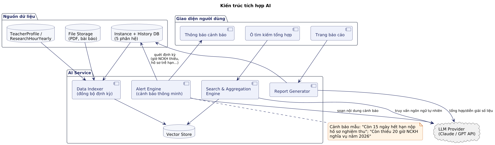

***Hình 9.1 — Kiến trúc tích hợp AI***

Dữ liệu từ các nguồn (Instance/History DB của Workflow Engine, hồ sơ khoa học cá nhân, kho tệp minh chứng) được đồng bộ định kỳ vào một kho vector (Vector Store) thông qua thành phần Data Indexer, phục vụ tìm kiếm theo ngữ nghĩa (semantic search) thay vì chỉ tìm kiếm từ khóa chính xác. Các yêu cầu tìm kiếm/báo cáo/cảnh báo phức tạp được chuyển tiếp tới nhà cung cấp mô hình ngôn ngữ lớn (LLM Provider) để tổng hợp và diễn giải.

## 9.3. Mô tả chi tiết các chức năng AI

### 9.3.1. Tìm kiếm tổng hợp

Cho phép người dùng tìm kiếm bằng ngôn ngữ tự nhiên trên toàn bộ dữ liệu mà tài khoản có quyền truy cập (ví dụ: "các đề tài của Khoa CNTT đang chờ nghiệm thu", "bài báo của giảng viên Nguyễn Văn A năm 2025"), thay vì phải vào đúng phân hệ và áp bộ lọc thủ công. Kết quả trả về luôn kèm liên kết trực tiếp tới hồ sơ/bản ghi gốc để người dùng xác minh.

### 9.3.2. Báo cáo tự động

Sinh báo cáo tổng hợp theo yêu cầu (ví dụ: báo cáo tình hình NCKH của một Khoa trong một học kỳ, báo cáo tổng số giờ NCKH đã hoàn thành/còn thiếu toàn trường) bằng cách truy vấn số liệu thực tế từ cơ sở dữ liệu trước, sau đó dùng LLM diễn giải và trình bày lại theo văn phong báo cáo — không cho phép AI tự suy diễn số liệu không có trong dữ liệu nguồn (đã quy định tại NFR-AI-01, Chương 2).

### 9.3.3. Cảnh báo thông minh

Thành phần Alert Engine quét định kỳ dữ liệu vận hành để chủ động phát hiện và gửi thông báo cho người dùng/cấp quản lý liên quan trước khi phát sinh rủi ro, ví dụ:

-   Nhắc nhở hồ sơ sắp tới hạn xử lý (còn N ngày tới hạn nộp/hạn thẩm định theo quy trình).
-   Cảnh báo giảng viên có nguy cơ không đạt định mức giờ NCKH nghĩa vụ trước khi kết thúc năm học.
-   Cảnh báo cho Trưởng/Phó Khoa về số lượng hồ sơ tồn đọng chưa xử lý thuộc đơn vị phụ trách.

Nội dung cảnh báo được LLM soạn thảo theo ngữ cảnh cụ thể của từng người nhận, nhưng điều kiện kích hoạt cảnh báo luôn dựa trên quy tắc tường minh (rule-based) truy vấn trực tiếp từ cơ sở dữ liệu, đảm bảo tính chính xác và có thể kiểm chứng.

**PHẦN III — CHỨC NĂNG NGHIỆP VỤ THEO 5 PHÂN HỆ**

# CHƯƠNG 10. PHÂN HỆ: THỰC HIỆN ĐỀ TÀI NCKH CẤP TRƯỜNG

Mã quy trình tham chiếu: QT.KHCN.02. Phân hệ quản lý toàn bộ vòng đời một đề tài NCKH cấp trường, từ mở đợt đăng ký, xét duyệt tuyến đầu, nộp thuyết minh, phê duyệt và ký hợp đồng, thực hiện có báo cáo tiến độ định kỳ, đến nghiệm thu và công nhận kết quả. Các chức năng Actor/phân quyền, Quản lý Hội đồng, Xử lý biên bản Hội đồng, Form/PDF pipeline và Thông báo/truy vết trước đây được liệt kê riêng trong FRS gốc nay đã chuyển thành chức năng dùng chung (Chương 6–9), không lặp lại tại đây.

## 10.1. Danh sách chức năng con (module)

| **Mã** | **Module** | **Số UC** |
| --- | --- | --- |
| M01 | Quản lý đợt đăng ký | 7 |
| M02 | Đăng ký và xét duyệt tuyến đầu | 15 |
| M03 | Xét duyệt đề xuất sơ bộ | 4 |
| M04 | Nộp thuyết minh chi tiết | 1 |
| M05 | Phê duyệt thuyết minh và ký hợp đồng | 8 |
| M06 | Thực hiện và báo cáo tiến độ | 2 |
| M07 | Nộp hồ sơ và nghiệm thu | 7 |
| M08 | Chỉnh sửa sau nghiệm thu | 3 |
| M09 | Công nhận kết quả | 2 |

*Tổng cộng: 9 module, 49 yêu cầu chức năng (UC) thuộc phạm vi nghiệp vụ riêng của phân hệ — chưa tính các UC dùng chung đã chuyển sang Chương 6–9.*

## 10.2. Bảng phân quyền theo actor

| **Chức năng** | **CNĐT** | **Đơn vị** | **P.KHCN** | **HĐKH** | **BGH** |
| --- | --- | --- | --- | --- | --- |
| Đăng ký đề tài, nộp thuyết minh | X | — | — | — | — |
| Xét duyệt tuyến đầu | — | X | — | — | — |
| Xét duyệt đề xuất sơ bộ | — | — | X | — | — |
| Phê duyệt thuyết minh & ký hợp đồng | — | — | — | — | X |
| Báo cáo tiến độ | X | — | — | — | — |
| Đánh giá nghiệm thu | — | — | — | X | — |
| Công nhận kết quả | — | — | X | — | — |

## 10.3. Sơ đồ Use Case

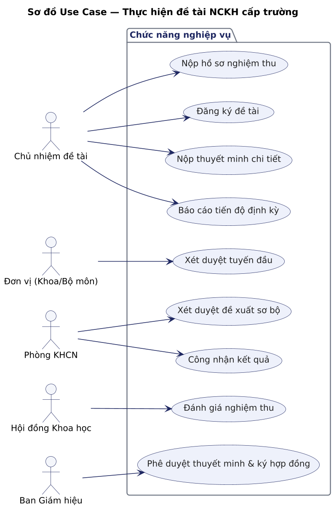

***Hình 10.1 — Sơ đồ Use Case: THỰC HIỆN ĐỀ TÀI NCKH CẤP TRƯỜNG***

## 10.4. Sơ đồ lớp

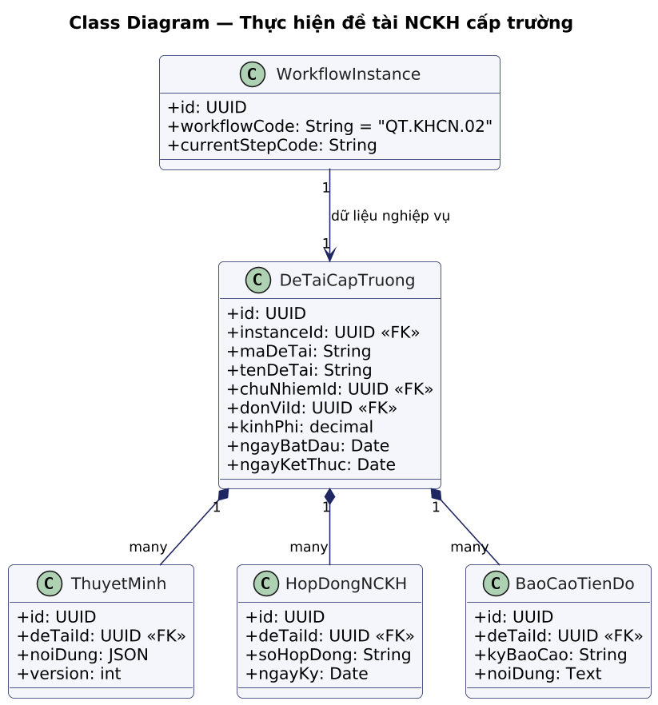

***Hình 10.2 — Class Diagram: THỰC HIỆN ĐỀ TÀI NCKH CẤP TRƯỜNG***

## 10.5. Sơ đồ tuần tự

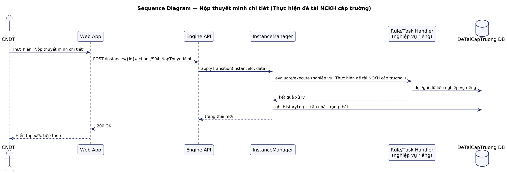

***Hình 10.3 — Sequence Diagram minh họa luồng chính***

## 10.6. Sơ đồ trạng thái

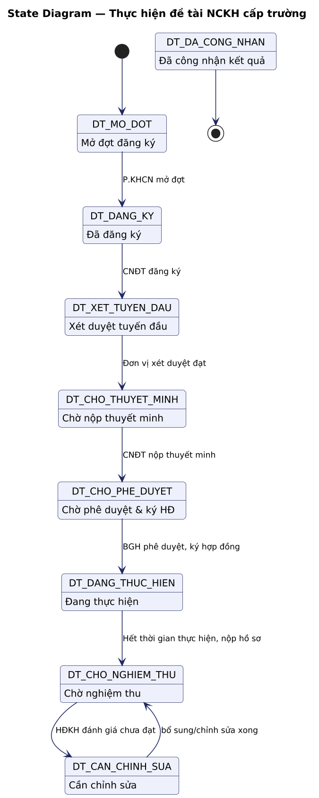

***Hình 10.4 — State Diagram trạng thái hồ sơ***

## 10.7. Bảng dữ liệu chi tiết

| **Bảng** | **Trường khóa chính** | **Trường khóa ngoại** | **Mô tả** |
| --- | --- | --- | --- |
| DeTaiCapTruong | id (PK) | instanceId → WorkflowInstance; chuNhiemId → Account; donViId → Đơn vị | Thông tin chung của đề tài: mã, tên, kinh phí, thời gian thực hiện |
| ThuyetMinh | id (PK) | deTaiId → DeTaiCapTruong | Nội dung thuyết minh chi tiết, version hoá theo lần nộp |
| HopDongNCKH | id (PK) | deTaiId → DeTaiCapTruong | Hợp đồng thực hiện đề tài đã ký |
| BaoCaoTienDo | id (PK) | deTaiId → DeTaiCapTruong | Báo cáo tiến độ theo từng kỳ báo cáo |

# CHƯƠNG 11. PHÂN HỆ: NGHIỆM THU SẢN PHẨM NGHIÊN CỨU KHOA HỌC

Mã quy trình tham chiếu: QT.KHCN.01. Phân hệ xử lý hồ sơ nghiệm thu sản phẩm NCKH (bài báo, sách, sản phẩm ứng dụng...) của giảng viên, từ chuẩn bị hồ sơ, kiểm tra sơ bộ và trùng lắp, rà soát chi tiết, đánh giá của Hội đồng Khoa học, đến cấp giấy xác nhận và xử lý nghĩa vụ tài chính/tiết NCKH.

## 11.1. Danh sách chức năng con (module)

| **Mã** | **Module** | **Số UC** |
| --- | --- | --- |
| M01 | Chuẩn bị và nộp hồ sơ | 6 |
| M02 | Kiểm tra sơ bộ và trùng lắp | 5 |
| M03 | Rà soát chi tiết (P.KHCN) | 3 |
| M04 | Hội đồng Khoa học đánh giá | 4 |
| M05 | Cấp giấy xác nhận | 3 |
| M06 | Xác nhận lưu chiểu và nghĩa vụ | 3 |
| M07 | Thanh toán / tính tiết NCKH | 4 |
| M08 | Lưu trữ hồ sơ | 2 |

*Tổng cộng: 8 module, 30 yêu cầu chức năng (UC) thuộc phạm vi nghiệp vụ riêng của phân hệ — chưa tính các UC dùng chung đã chuyển sang Chương 6–9.*

## 11.2. Bảng phân quyền theo actor

| **Chức năng** | **TG** | **ĐVQLTT/TTTV** | **P.KHCN** | **HĐKH** | **TCKT** |
| --- | --- | --- | --- | --- | --- |
| Chuẩn bị & nộp hồ sơ | X | — | — | — | — |
| Kiểm tra sơ bộ & trùng lắp | — | X | — | — | — |
| Rà soát chi tiết | — | — | X | — | — |
| Đánh giá của Hội đồng | — | — | — | X | — |
| Cấp giấy xác nhận | — | — | X | — | — |
| Nộp lưu chiểu, nghĩa vụ | X | — | — | — | — |
| Thanh toán / tính tiết NCKH | — | — | — | — | X |

## 11.3. Sơ đồ Use Case

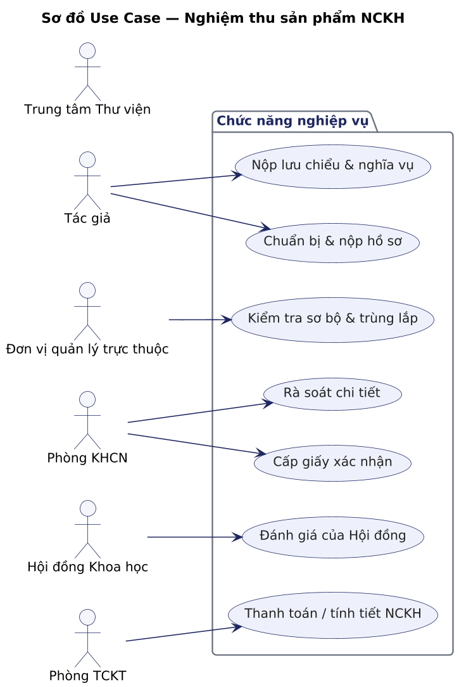

***Hình 11.1 — Sơ đồ Use Case: NGHIỆM THU SẢN PHẨM NGHIÊN CỨU KHOA HỌC***

## 11.4. Sơ đồ lớp

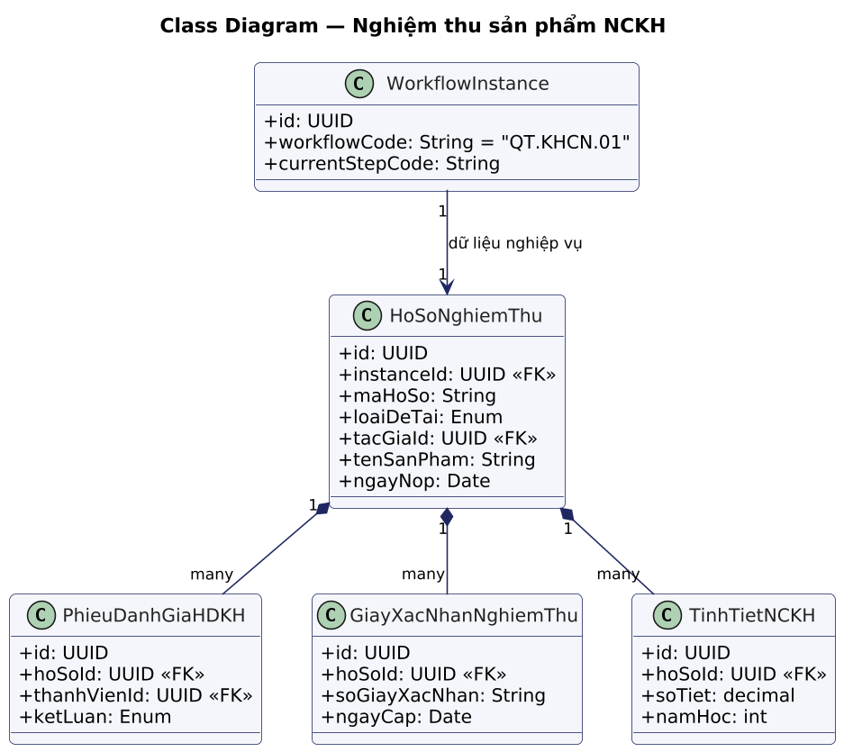

***Hình 11.2 — Class Diagram: NGHIỆM THU SẢN PHẨM NGHIÊN CỨU KHOA HỌC***

## 11.5. Sơ đồ tuần tự

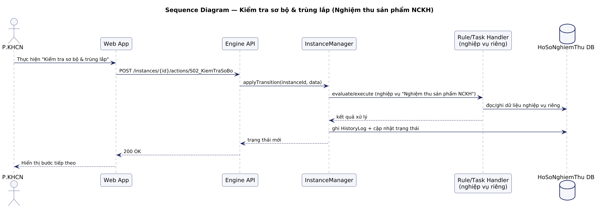

***Hình 11.3 — Sequence Diagram minh họa luồng chính***

## 11.6. Sơ đồ trạng thái

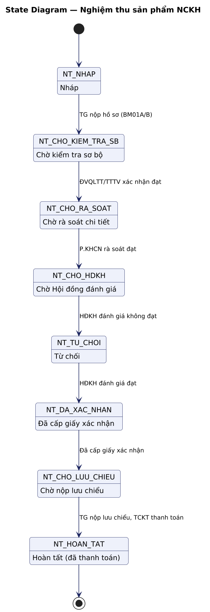

***Hình 11.4 — State Diagram trạng thái hồ sơ***

## 11.7. Bảng dữ liệu chi tiết

| **Bảng** | **Trường khóa chính** | **Trường khóa ngoại** | **Mô tả** |
| --- | --- | --- | --- |
| HoSoNghiemThu | id (PK) | instanceId → WorkflowInstance; tacGiaId → Account | Loại đề tài, tên sản phẩm, ngày nộp |
| PhieuDanhGiaHDKH | id (PK) | hoSoId → HoSoNghiemThu; thanhVienId → Account | Kết luận đánh giá của từng thành viên Hội đồng |
| GiayXacNhanNghiemThu | id (PK) | hoSoId → HoSoNghiemThu | Số giấy xác nhận, ngày cấp |
| TinhTietNCKH | id (PK) | hoSoId → HoSoNghiemThu | Số tiết NCKH quy đổi, năm học áp dụng |

# CHƯƠNG 12. PHÂN HỆ: QUẢN LÝ ĐỀ TÀI CẤP NHÀ NƯỚC, CẤP TỈNH/BỘ, NGÀNH

Mã quy trình tham chiếu: QT.KHCN.04. Phân hệ theo dõi các đề tài do cơ quan quản lý cấp trên (Bộ, Quỹ, Tỉnh) tài trợ, từ tiếp nhận thông báo, nộp hồ sơ đăng ký, theo dõi phê duyệt và giao nhiệm vụ, báo cáo tiến độ, nghiệm thu cấp cơ sở, đến hỗ trợ hồ sơ nghiệm thu và công nhận kết quả ở cấp quản lý cao hơn.

## 12.1. Danh sách chức năng con (module)

| **Mã** | **Module** | **Số UC** |
| --- | --- | --- |
| M01 | Tiếp nhận thông báo & tổng hợp đăng ký | 5 |
| M02 | Theo dõi phê duyệt & giao nhiệm vụ | 4 |
| M03 | Theo dõi tiến độ | 3 |
| M04 | Nghiệm thu cơ sở | 6 |
| M05 | Hỗ trợ hồ sơ nghiệm thu cấp trên | 3 |
| M06 | Hoàn thiện báo cáo sau nghiệm thu, lưu hồ sơ | 3 |

*Tổng cộng: 6 module, 24 yêu cầu chức năng (UC) thuộc phạm vi nghiệp vụ riêng của phân hệ — chưa tính các UC dùng chung đã chuyển sang Chương 6–9.*

## 12.2. Bảng phân quyền theo actor

| **Chức năng** | **CNĐT** | **P.KHCN** | **—** | **HĐNT** | **—** |
| --- | --- | --- | --- | --- | --- |
| Tiếp nhận thông báo, tổng hợp đăng ký | — | X | — | — | — |
| Nộp hồ sơ đăng ký | X | — | — | — | — |
| Theo dõi phê duyệt & giao nhiệm vụ | — | X | — | — | — |
| Báo cáo tiến độ | X | — | — | — | — |
| Nghiệm thu cơ sở | — | — | — | X | — |
| Hỗ trợ hồ sơ nghiệm thu cấp trên | — | X | — | — | — |

## 12.3. Sơ đồ Use Case

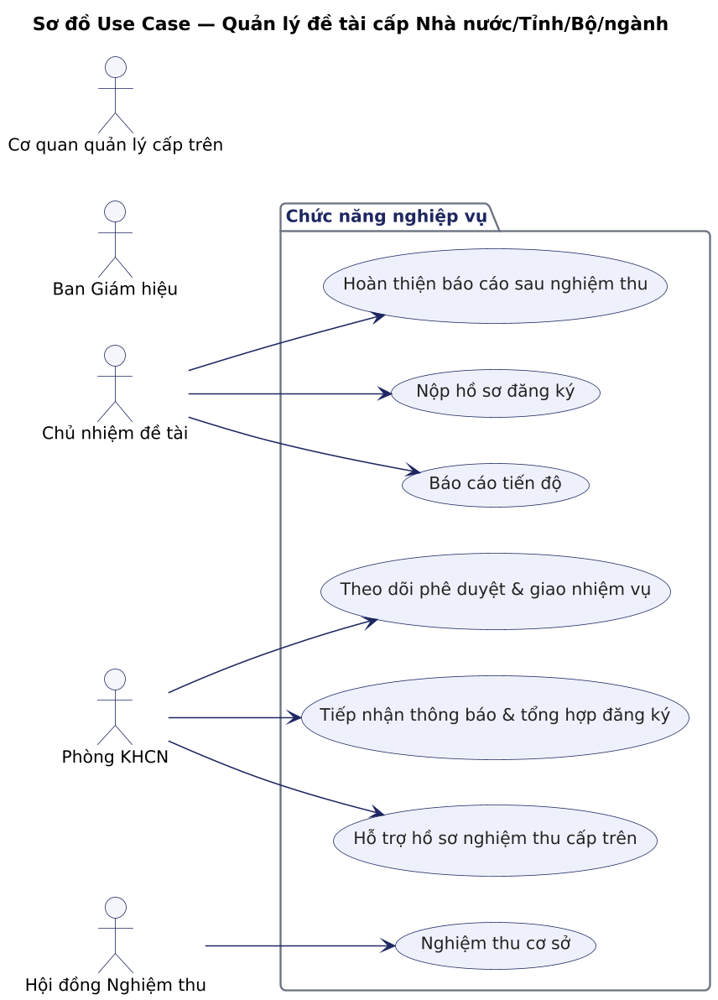

***Hình 12.1 — Sơ đồ Use Case: QUẢN LÝ ĐỀ TÀI CẤP NHÀ NƯỚC, CẤP TỈNH/BỘ, NGÀNH***

## 12.4. Sơ đồ lớp

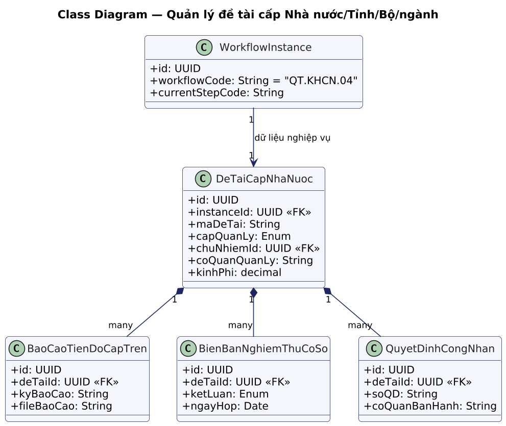

***Hình 12.2 — Class Diagram: QUẢN LÝ ĐỀ TÀI CẤP NHÀ NƯỚC, CẤP TỈNH/BỘ, NGÀNH***

## 12.5. Sơ đồ tuần tự

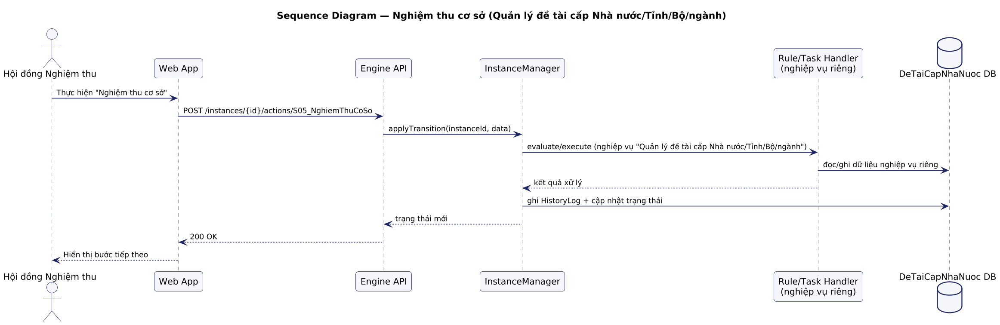

***Hình 12.3 — Sequence Diagram minh họa luồng chính***

## 12.6. Sơ đồ trạng thái

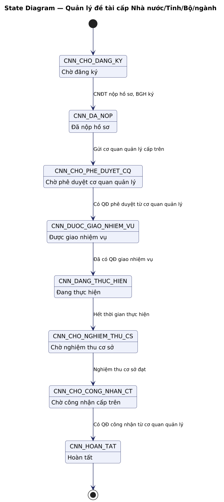

***Hình 12.4 — State Diagram trạng thái hồ sơ***

## 12.7. Bảng dữ liệu chi tiết

| **Bảng** | **Trường khóa chính** | **Trường khóa ngoại** | **Mô tả** |
| --- | --- | --- | --- |
| DeTaiCapNhaNuoc | id (PK) | instanceId → WorkflowInstance; chuNhiemId → Account | Cấp quản lý, cơ quan quản lý, kinh phí |
| BaoCaoTienDoCapTren | id (PK) | deTaiId → DeTaiCapNhaNuoc | Báo cáo tiến độ gửi cơ quan quản lý cấp trên |
| BienBanNghiemThuCoSo | id (PK) | deTaiId → DeTaiCapNhaNuoc | Kết luận nghiệm thu cấp cơ sở |
| QuyetDinhCongNhan | id (PK) | deTaiId → DeTaiCapNhaNuoc | Số quyết định, cơ quan ban hành |

# CHƯƠNG 13. PHÂN HỆ: CHUYỂN GIAO CÔNG NGHỆ VÀ DỊCH VỤ

Mã quy trình tham chiếu: QT.KHCN.05. Phân hệ quản lý việc chuyển giao công nghệ/dịch vụ khoa học cho bên ngoài, từ lập đề xuất, thẩm định và phê duyệt đăng ký, đàm phán và ký hợp đồng, thực hiện và báo cáo tiến độ, nghiệm thu cơ sở, đến nghiệm thu/bàn giao/thanh lý với đối tác và quyết toán, phân chia lợi nhuận.

## 13.1. Danh sách chức năng con (module)

| **Mã** | **Module** | **Số UC** |
| --- | --- | --- |
| M01 | Lập đề xuất | 4 |
| M02 | Thẩm định & phê duyệt đăng ký | 7 |
| M03 | Đàm phán & ký hợp đồng | 3 |
| M04 | Thực hiện & báo cáo tiến độ | 2 |
| M05 | Nghiệm thu cơ sở | 7 |
| M06 | Nghiệm thu / bàn giao / thanh lý đối tác | 3 |
| M07 | Quyết toán & lưu hồ sơ | 3 |

*Tổng cộng: 7 module, 29 yêu cầu chức năng (UC) thuộc phạm vi nghiệp vụ riêng của phân hệ — chưa tính các UC dùng chung đã chuyển sang Chương 6–9.*

## 13.2. Bảng phân quyền theo actor

| **Chức năng** | **CNĐT** | **P.KHCN** | **HĐXD** | **HĐNT** | **TCKT** |
| --- | --- | --- | --- | --- | --- |
| Lập đề xuất | X | — | — | — | — |
| Thẩm định & phê duyệt đăng ký | — | — | X | — | — |
| Đàm phán & ký hợp đồng | X | — | — | — | X |
| Báo cáo tiến độ | X | — | — | — | — |
| Nghiệm thu cơ sở | — | — | — | X | — |
| Nghiệm thu/bàn giao/thanh lý đối tác | X | — | — | — | — |
| Quyết toán & phân chia lợi nhuận | — | — | — | — | X (TCKT) |

## 13.3. Sơ đồ Use Case

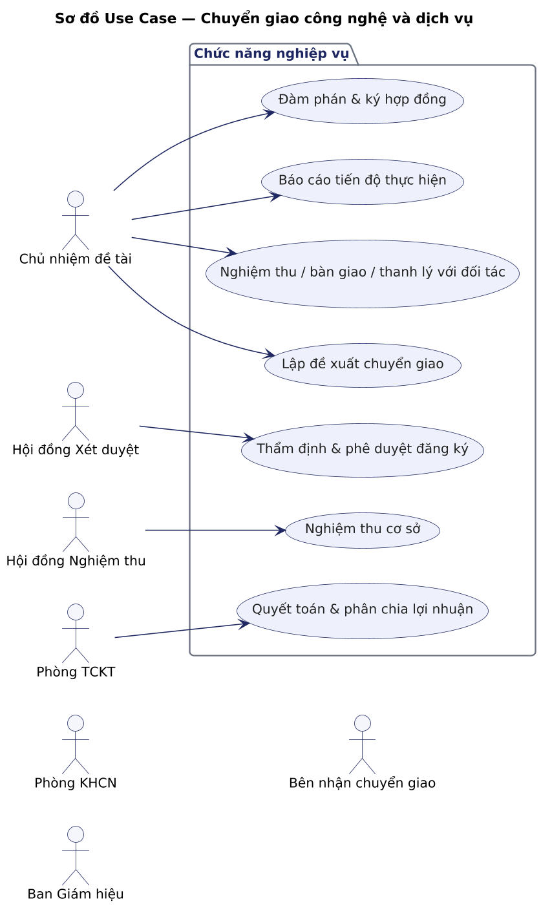

***Hình 13.1 — Sơ đồ Use Case: CHUYỂN GIAO CÔNG NGHỆ VÀ DỊCH VỤ***

## 13.4. Sơ đồ lớp

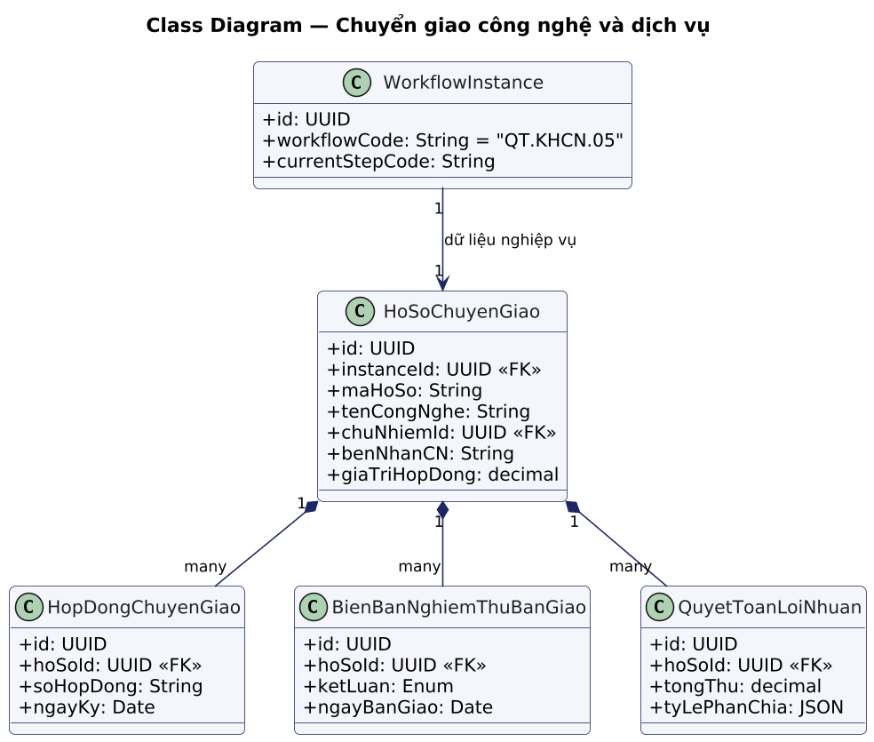

***Hình 13.2 — Class Diagram: CHUYỂN GIAO CÔNG NGHỆ VÀ DỊCH VỤ***

## 13.5. Sơ đồ tuần tự

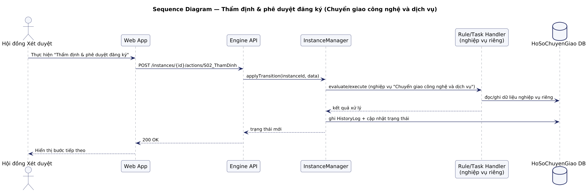

***Hình 13.3 — Sequence Diagram minh họa luồng chính***

## 13.6. Sơ đồ trạng thái

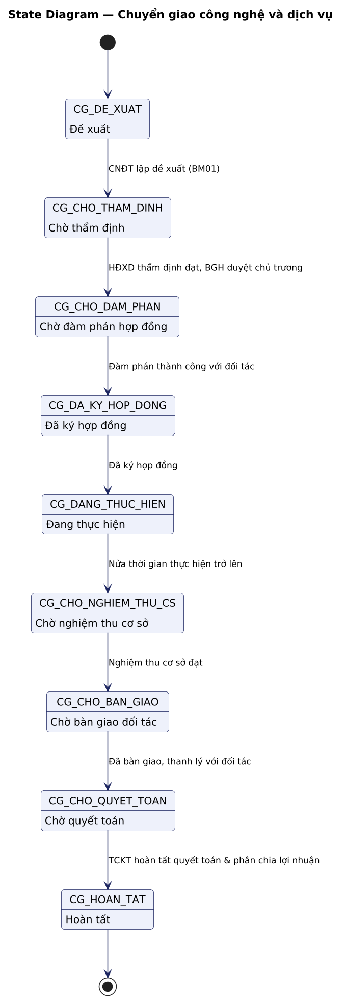

***Hình 13.4 — State Diagram trạng thái hồ sơ***

## 13.7. Bảng dữ liệu chi tiết

| **Bảng** | **Trường khóa chính** | **Trường khóa ngoại** | **Mô tả** |
| --- | --- | --- | --- |
| HoSoChuyenGiao | id (PK) | instanceId → WorkflowInstance; chuNhiemId → Account | Tên công nghệ, bên nhận chuyển giao, giá trị hợp đồng |
| HopDongChuyenGiao | id (PK) | hoSoId → HoSoChuyenGiao | Số hợp đồng, ngày ký |
| BienBanNghiemThuBanGiao | id (PK) | hoSoId → HoSoChuyenGiao | Kết luận nghiệm thu, ngày bàn giao |
| QuyetToanLoiNhuan | id (PK) | hoSoId → HoSoChuyenGiao | Tổng thu, tỷ lệ phân chia lợi nhuận |

# CHƯƠNG 14. PHÂN HỆ: TỔ CHỨC HỘI NGHỊ, HỘI THẢO

Mã quy trình tham chiếu: QT.KHCN.03. Phân hệ quản lý việc tổ chức Hội nghị/Hội thảo theo 3 hình thức (chuyên đề, Quốc gia, Quốc tế), từ đăng ký tổ chức, thẩm định và phê duyệt của BGH, xin phép cơ quan nhà nước (riêng hình thức Quốc tế), lập kế hoạch chi tiết, gọi bài và phản biện, thu phí, tổ chức sự kiện, đến thanh toán và báo cáo kết quả.

## 14.1. Danh sách chức năng con (module)

| **Mã** | **Module** | **Số UC** |
| --- | --- | --- |
| M01 | Đăng ký tổ chức (3 hình thức) | 5 |
| M02 | Thẩm định & phê duyệt BGH | 4 |
| M03 | Xin phép cơ quan nhà nước (Quốc tế) | 3 |
| M04 | Lập kế hoạch chi tiết | 2 |
| M05 | Thiết kế website/email | 2 |
| M06 | Gọi bài, phản biện, xuất bản kỷ yếu | 3 |
| M07 | Thu phí tham dự | 2 |
| M08 | Tổ chức sự kiện | 2 |
| M09 | Thanh toán & báo cáo kết quả | 3 |
| M10 | Lưu trữ hồ sơ | 2 |

*Tổng cộng: 10 module, 28 yêu cầu chức năng (UC) thuộc phạm vi nghiệp vụ riêng của phân hệ — chưa tính các UC dùng chung đã chuyển sang Chương 6–9.*

## 14.2. Bảng phân quyền theo actor

| **Chức năng** | **ĐVTC** | **P.KHCN** | **CQNN/HTQT** | **HĐKH** | **TCKT** |
| --- | --- | --- | --- | --- | --- |
| Đăng ký tổ chức | X | — | — | — | — |
| Thẩm định & phê duyệt BGH | — | X | — | — | X |
| Xin phép CQNN (Quốc tế) | X | — | — | — | X |
| Gọi bài, phản biện | X | — | — | X | — |
| Thu phí tham dự | — | — | — | — | X (TCKT) |
| Tổ chức sự kiện | X | — | — | — | — |
| Thanh toán & báo cáo kết quả | X | — | — | — | X (TCKT) |

## 14.3. Sơ đồ Use Case

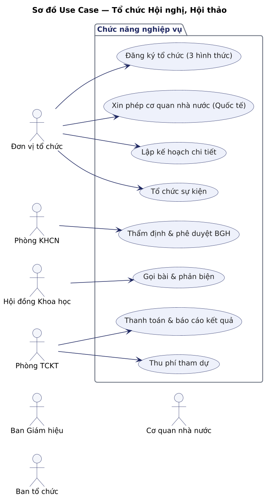

***Hình 14.1 — Sơ đồ Use Case: TỔ CHỨC HỘI NGHỊ, HỘI THẢO***

## 14.4. Sơ đồ lớp

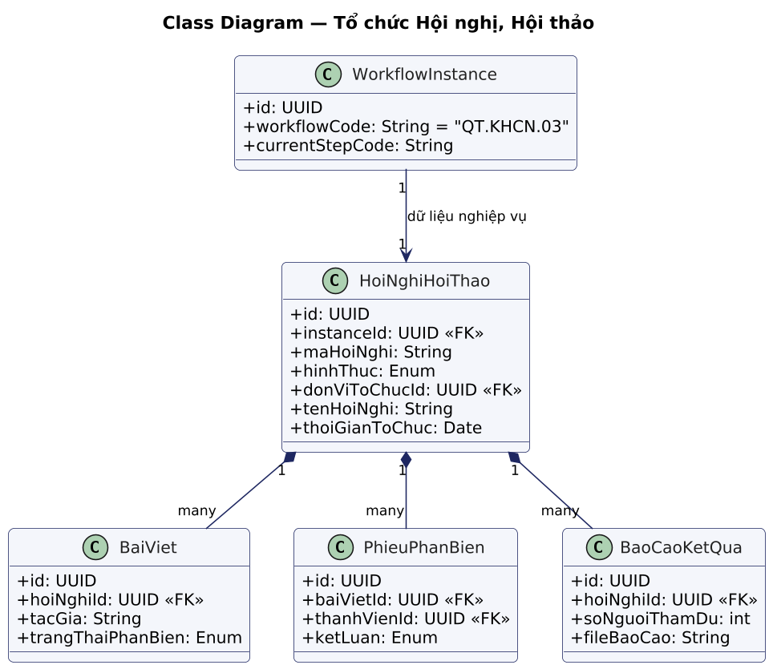

***Hình 14.2 — Class Diagram: TỔ CHỨC HỘI NGHỊ, HỘI THẢO***

## 14.5. Sơ đồ tuần tự

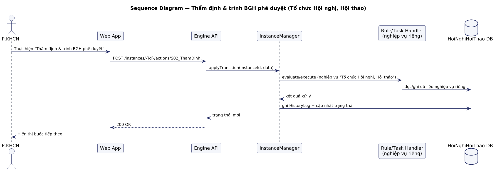

***Hình 14.3 — Sequence Diagram minh họa luồng chính***

## 14.6. Sơ đồ trạng thái

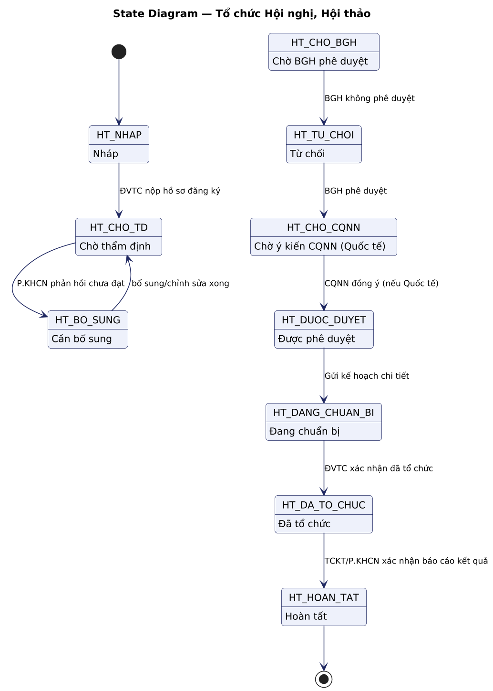

***Hình 14.4 — State Diagram trạng thái hồ sơ***

## 14.7. Bảng dữ liệu chi tiết

| **Bảng** | **Trường khóa chính** | **Trường khóa ngoại** | **Mô tả** |
| --- | --- | --- | --- |
| HoiNghiHoiThao | id (PK) | instanceId → WorkflowInstance; donViToChucId → Đơn vị | Hình thức, tên hội nghị, thời gian tổ chức |
| BaiViet | id (PK) | hoiNghiId → HoiNghiHoiThao | Tác giả, trạng thái phản biện |
| PhieuPhanBien | id (PK) | baiVietId → BaiViet; thanhVienId → Account | Kết luận phản biện của từng thành viên |
| BaoCaoKetQua | id (PK) | hoiNghiId → HoiNghiHoiThao | Số người tham dự thực tế, file báo cáo |

**PHẦN IV — GIAO DIỆN, BẢO MẬT VÀ KẾ HOẠCH TRIỂN KHAI**

# CHƯƠNG 15. THIẾT KẾ GIAO DIỆN NGƯỜI DÙNG (TỔNG QUAN)

## 15.1. Nguyên tắc thiết kế

-   Giao diện responsive, ưu tiên trải nghiệm trên máy tính (thao tác chính) và hỗ trợ đầy đủ trên thiết bị di động cho các tác vụ tra cứu/duyệt nhanh.
-   Mỗi biểu mẫu (BM) được xây dựng thành một component giao diện riêng, code trực tiếp theo đúng cấu trúc field đã mô tả trong JSON Schema tương ứng (không dùng cơ chế tự sinh giao diện từ schema), nhằm đảm bảo khả năng tùy biến layout theo nhu cầu người dùng thực tế.
-   Giao diện chỉ hiển thị chức năng và dữ liệu mà tài khoản đăng nhập có quyền truy cập, đồng bộ với bảng phân quyền tại Chương 7.
-   Trạng thái xử lý của hồ sơ (theo mô hình trạng thái tại Chương 5) luôn được hiển thị trực quan bằng nhãn màu và có thể xem lại lịch sử xử lý đầy đủ ngay trên giao diện chi tiết hồ sơ.

## 15.2. Danh sách nhóm màn hình chính

| **Nhóm màn hình** | **Mô tả** |
| --- | --- |
| Đăng nhập / Trang chủ | Đăng nhập qua DNTU SSO; tổng quan cá nhân (hồ sơ, giờ NCKH, cảnh báo gần nhất) |
| Hồ sơ khoa học cá nhân | Đề tài tham gia, hướng dẫn sinh viên, bài báo đã nghiệm thu, giờ NCKH theo năm |
| 5 phân hệ nghiệp vụ | Danh sách hồ sơ theo từng phân hệ, biểu mẫu nhập liệu, theo dõi trạng thái xử lý |
| Hội đồng | Danh sách hồ sơ cần đánh giá/phản biện, biểu mẫu chấm điểm/nhận xét |
| Báo cáo & Thống kê | Báo cáo tổng hợp theo đơn vị/năm học, có hỗ trợ AI diễn giải số liệu |
| Tìm kiếm tổng hợp (AI) | Ô tìm kiếm ngôn ngữ tự nhiên, kết quả liên kết trực tiếp hồ sơ gốc |
| Quản trị hệ thống | Quản lý tài khoản, phân quyền theo nhóm nhân sự, xem lịch sử publish workflow/biểu mẫu |

# CHƯƠNG 16. YÊU CẦU AN TOÀN HỆ THỐNG VÀ BẢO MẬT

## 16.1. Nguyên tắc bảo mật tổng thể

-   Xác thực tập trung qua hệ thống SSO của Trường, không lưu trữ mật khẩu riêng trong hệ thống.
-   Phân quyền chi tiết theo 3 chiều Vai trò – Nhóm nhân sự – Phạm vi (Chương 7), áp dụng nhất quán ở cả tầng API và tầng giao diện.
-   Toàn bộ thao tác làm thay đổi trạng thái hồ sơ được ghi vết vào Audit log dạng chỉ-thêm (append-only), không cung cấp chức năng sửa/xóa lịch sử qua nghiệp vụ.
-   Dữ liệu nhạy cảm (thông tin cá nhân giảng viên, nội dung đánh giá/phản biện) được giới hạn hiển thị nghiêm ngặt theo đúng vai trò được cấp quyền xem.
-   Kết nối giữa các service nội bộ (Engine, Form Pipeline, AI Service...) được thực hiện trong mạng nội bộ của hạ tầng Docker, không public trực tiếp ra ngoài trừ API Gateway.

## 16.2. Tính không thể chối từ (Non-repudiation)

Đây là yêu cầu xuyên suốt đã được thiết kế chi tiết tại Chương 5 (cơ chế versioning và Freeze của Workflow Engine). Tổng hợp lại 3 nguyên tắc cốt lõi:

-   Mọi quyết định phê duyệt/đánh giá/nghiệm thu đều gắn với đúng version quy trình và biểu mẫu đã áp dụng tại thời điểm xử lý, không bị ảnh hưởng bởi các thay đổi sau này.
-   Bảng lịch sử tự chứa đầy đủ thông tin dạng snapshot, không phụ thuộc dữ liệu tham chiếu có thể thay đổi.
-   Có cơ chế mã băm toàn vẹn (integrity hash) cho mỗi bản ghi lịch sử, hỗ trợ phát hiện chỉnh sửa hồi tố trái phép nếu có tranh chấp phát sinh.

## 16.3. Sao lưu và khôi phục dữ liệu

Hệ thống cần thiết lập cơ chế sao lưu định kỳ (backup) cho cơ sở dữ liệu và kho tệp minh chứng, với tần suất và thời gian lưu trữ cụ thể cần xác minh theo chính sách quản trị hạ tầng của đơn vị tại thời điểm triển khai. Chỉ số RPO (Recovery Point Objective) và RTO (Recovery Time Objective) cần được xác định và kiểm thử trước khi đưa hệ thống vào vận hành chính thức.

# CHƯƠNG 17. TÓM TẮT KẾ HOẠCH TRIỂN KHAI

## 17.1. Lộ trình 6 giai đoạn

Kế hoạch triển khai chi tiết (nhân sự, effort, chi phí) được trình bày trong tài liệu kế hoạch dự án riêng; nội dung dưới đây chỉ tóm tắt lại mốc thời gian gắn với các hạng mục thiết kế đã trình bày trong tài liệu này.

| **GĐ** | **Nội dung** | **Thời gian** |
| --- | --- | --- |
| 1 | Khảo sát, phân tích yêu cầu; xây dựng SRS | Tháng 1 (tuần 1–2) |
| 2 | Thiết kế kiến trúc, CSDL, UI/UX; xây tầng nền tảng dùng chung | Tháng 1 (tuần 3–4) |
| 3 | Phát triển 3 phân hệ ưu tiên (Đề tài cấp trường, Nghiệm thu, Chuyển giao CN) | Tháng 2 (tuần 1–3) |
| 4 | Hoàn thiện Đề tài cấp trường; phát triển Cấp NN/Tỉnh/Bộ và Hội nghị Hội thảo; thống kê giờ NCKH, báo cáo AI | Tháng 2 (tuần 4) – Tháng 3 (tuần 2) |
| 5 | Kiểm thử toàn hệ thống; hiệu chỉnh sau thử nghiệm | Tháng 3 (tuần 3) |
| 6 | Hoàn thiện tài liệu kỹ thuật, hướng dẫn sử dụng; nghiệm thu, bàn giao | Tháng 3 (tuần 4) |

## 17.2. Định hướng mở rộng sau giai đoạn 1

-   Hoàn thiện chiều sâu các UC phụ trợ chưa đưa vào phạm vi MVP (một số nhánh ngoại lệ, thống kê nâng cao).
-   Mở rộng kho vector và tinh chỉnh chất lượng chức năng AI dựa trên dữ liệu vận hành thực tế sau khi hệ thống đi vào sử dụng.
-   Đánh giá lại nhu cầu tách service độc lập (Engine, Form Pipeline, Handlers) khi quy mô người dùng/dữ liệu tăng, theo định hướng kiến trúc đã chuẩn bị sẵn tại Chương 3.

# PHỤ LỤC

## A. Danh mục từ viết tắt

| **Viết tắt** | **Giải nghĩa** |
| --- | --- |
| DNTU | Trường Đại học Công nghệ Đồng Nai |
| NCKH | Nghiên cứu khoa học |
| P.KHCN | Phòng Khoa học Công nghệ |
| HĐKH / HĐNT / HĐXD | Hội đồng Khoa học / Hội đồng Nghiệm thu / Hội đồng Xét duyệt |
| BGH | Ban Giám hiệu |
| TCKT | Phòng Tài chính - Kế toán |
| TTTV | Trung tâm Thư viện |
| ĐVQLTT / ĐVTC | Đơn vị quản lý trực thuộc / Đơn vị tổ chức |
| RBAC | Role-Based Access Control — kiểm soát truy cập theo vai trò |
| SSO | Single Sign-On — đăng nhập một lần |
| LLM | Large Language Model — mô hình ngôn ngữ lớn |
| UC / BR / AC / NFR | Use Case / Business Rule / Acceptance Criteria / Non-Functional Requirement |
| FRS | Functional Requirements Specification — đặc tả yêu cầu chức năng |
| ERD | Entity Relationship Diagram — sơ đồ thực thể quan hệ |
| BM | Biểu mẫu |

## B. Tài liệu tham chiếu

-   FRS-NCKH-001 — Đặc tả yêu cầu chức năng: Thực hiện đề tài nghiên cứu khoa học cấp trường.
-   FRS-NCKH-002 — Đặc tả yêu cầu chức năng: Nghiệm thu sản phẩm nghiên cứu khoa học.
-   FRS-NCKH-003 — Đặc tả yêu cầu chức năng: Quản lý đề tài cấp Nhà nước, cấp Tỉnh/Bộ, ngành.
-   FRS-NCKH-004 — Đặc tả yêu cầu chức năng: Chuyển giao công nghệ và dịch vụ.
-   FRS-NCKH-005 — Đặc tả yêu cầu chức năng: Tổ chức Hội nghị, Hội thảo.
-   Quy chế chi tiêu nội bộ và quy định giờ NCKH nghĩa vụ của Trường (cần bổ sung bản mới nhất tại thời điểm triển khai).